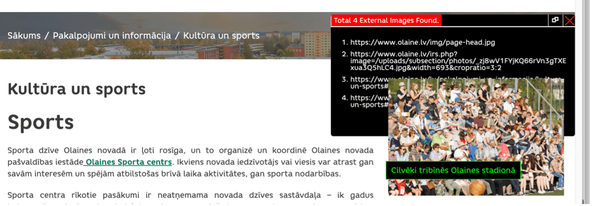

Digitālajā vidē attēlu piekļūstamību nodrošina attēlu tekstuālā alternatīva jeb tā dēvētie ALT teksti. ALT teksts ir vizuālā attēla apraksts, ko, piem., neredzīgajiem lietotājiem nolasa ekrāna lasītājs. ALT tekstu nozīme- veicināt veiksmīgu lietotāju mijiedarbību ar tīmekļvietnes saturu; uzlabot organizāciju rezultātus Google meklētājā; sniegt aprakstu, ja attēla failu nav iespējams apskatīt (piem., lēns internets).
Attēlu dizainu ALT teksti nekādi neietekmē, jo ar neapbruņotu aci nav saskatāmi. Tos "redz" tikai ekrāna lasīšanas ierīces, kā arī lietotāji, kuri datoros atslēdz attēlu atspoguļošanas funkciju, lai paātrinātu lejupielādi situācijās, kad ir vājš interneta signāls. Proti, ALT teksti tiek iekļauti attēla lapas koda iezīmēs. Piemēram, šādi: ``.

### **5.1. Labā prakse**

- ALT tekstam precīzi jāapraksta attēls;
- ALT tekstam jābūt kodolīgam, bet jāizvairās no viena vārda apraksta;
- ALT teksti jāveido visiem attēliem;
- ALT tekstu aprakstā nevajag iekļaut vārdus “attēls” vai “bilde”.

Attēlu tekstuālās alternatīvas tiek veidotas, ņemot vērā to funkcionalitāti. Kopumā izšķir trīs veidu attēlus – **dekoratīvos, funkcionālos un statiskos**.

#### **5.1.1. Dekoratīvo attēlu noformējums**

Tie ir vizuāli elementi, kas tiek izmantoti satura noformējumam, taču to nekādi neietekmē, tāpēc var tikt pieņemts, ka lietotājiem par tiem nav jāzina. Tipiskākie dekoratīvo attēlu piemēri ir ikonas un bildes, kas tiek izmantotas uzmanības piesaistīšanai. Šie attēli tiek apzīmēti ar tā dēvēto nulles ALT tekstu: alt="".

> **Piemērs**. Lapā norādītas vairākas satura izvēlnes, kurām pievienotas arī vizuālās ikonas. Šajā gadījumā ikonām ir dekoratīva nozīme, jo tās tikai papildina satura tekstuālo noformējumu

#### **5.1.2. Funkcionālo attēlu noformējums**

Funkcionālie attēli ir orientēti uz darbību – var pildīt saites funkcijas (uzklikšķinot uz attēla, atveras noteikta saite) vai raksturot noteiktas darbības (piemēram, meklēšanas logs, valodu izvēlne, poga sīkdatņu apstiprināšanai), tāpēc to tekstuālajām alternatīvām nav tieši jāapraksta attēlā redzamais. Pirmajā gadījumā ALT tekstā ir jānorāda konkrētās saites funkcija, piemēram: "Atvērt privātuma politiku", "Lejupielādēt Ministru kabineta noteikumus Nr.18 "Kārtība, kādā novērtē paredzētās darbības ietekmi uz vidi un akceptē paredzēto darbību". Savukārt otrajā gadījumā ALT tekstā ir jānorāda attēla funkcija. Piemēram, meklēšanas pogai piemērotākā tekstuālā alternatīva būtu "meklēt" vai "sākt meklēšanu", nevis "lupa".  
Šajā gadījumā, veidojot tekstuālās alternatīvas saistītajiem attēliem, ir jāievēro vienots stils:

- Pozitīvs piemērs navigācijas attēlu aprakstiem: "sadaļa Kontakti", "sadaļa Par mums", "sadaļa Darbības jomas", "sadaļa Noderīgi".
- Negatīvs piemērs navigācijas attēlu aprakstiem: "Kontakti", "sadaļa Par mums", "atvērt Darbības jomas", "sadaļa Noderīgi".

#### **5.1.3. Statisko attēlu noformējums**

Statisko attēlu mērķis ir papildināt tīmekļvietnes vai mobilās lietotnes saturu – fotogrāfijas, diagrammas, plakāti, infografikas, darba sludinājumi, reklāmas banneri u.c. Šajā gadījumā attēlu tekstuālajām alternatīvām jābūt daudz izsmeļošākām – tām ir jānodod lietotājiem attēla nozīme. Lai statiskajiem attēliem pievienotie ALT teksti būtu funkcionāli, to izveidē jāievēro šādas nianses:

- Izvairieties no vispārīgiem aprakstiem, piemēram, "IMG_2045", "plakāts", "Rīga" u.tml., jo tie nesniedz informāciju par konkrētā attēla saturu.
- Neizmantojiet attēlu aprakstos SEO atslēgvārdus, piemēram, "piekļūstamības ekspertu konsultācijas", "kvalitatīvas piekļūstamības konsultācijas", "piekļūstamības konsultācijas uzņēmējiem", "piekļūstamības konsultācijas valsts pārvaldei" u.tml.
- Nedublējiet attēlu aprakstos informāciju, kas ir ietverta saturā, ko tie papildina. Piemēram, ziņas, paziņojuma virsraksts nav uzskatāms par kvalitatīvu ALT tekstu attēlam, kas tajā tiek izmantots kā ilustrācija.
- Izmantojiet īsus, koncentrētus tekstus, piemēram: "Uz galda stāv atvērta piena paka un krūze." vai "Uzņēmuma vadītājs pasniedz balvu labākajam darbiniekam." Optimālais ALT teksta garums ir līdz 250 rakstu zīmēm.
- Izvairieties no liekvārdības. Nesāciet aprakstu ar tekstu "Attēlā redzams…" un neizmantojiet ALT tekstos tādus vārdus kā "poga", "saite", "attēls". Ekrāna lasīšanas ierīces šo informāciju nodrošina automātiski.
- Miniet attēla aprakstā krāsas, ja tām ir nozīme.
- Nebaidieties no humora, jo ALT tekstiem nav jābūt formāliem. Īpaši, ja attēls ir smieklīgs.
- Ja attēlā (piemēram, logotipā, reklāmas plakātā, darba sludinājumā, grafikā) ir iekļauts teksts, tas ir jāatspoguļo arī šī attēla tekstuālajā alternatīvā. Ja šis teksts ir apjomīgs un sarežģīts, iekļaujiet attēlu aprakstos tikai svarīgāko informāciju par to saturu un pievienojiet saiti uz tīmekļvietni, kurā pieejama detalizētāka informācija par pakalpojumu, pasākumu, vakanci, pētījuma rezultātiem u.tml. tekstuālā formātā.
- Ja iespējams, piesaistiet ALT tekstu izveidei nozares ekspertus. Tas ļaus izveidot kvalitatīvākas attēlu tekstuālās alternatīvas, jo jūs varat nepārzināt visas ar to vai citu tēmu saistītās nianses. Īpaši svarīgi tas ir, aprakstot dažādas preces un pakalpojumus. Tā ir šķietami nenozīmīga nianse, kurai dažkārt var būt ļoti nozīmīga loma attēla nozīmes paskaidrošanā. Piemēram, suņu audzētāju kluba tīmekļvietnē ievietoto attēlu aprakstos vēlams norādīt ne vien to, ka attēlā redzams suns, bet arī konkrētā suņa šķirnes nosaukumu. Savukārt, ja šis pats attēls ar suni tiek ievietots, lai padarītu vizuāli pievilcīgāku kāda parka tīmekļvietni vai ilustrētu rakstu, kurā ir aprakstītas aktīvās atpūtas iespējas ģimenēm, tā apraksts var būt vispārīgāks.

> **Labās prakses piemērs ALT tekstam**: “Āboliņu pļavā novietots zils spainis ar sarkanām zemenēm”

> **Sliktās prakses piemērs ALT tekstam**: “Zemenes”

### **5.2. Testēšana**

ALT teksti ir viens no piekļūstamības principiem, kuru pārbaudei ieteicams kombinēt automatizētos un lietotāju testus:

- **automatizētie testi** ir piemēroti, lai ātri noteiktu attēla tekstuālās alternatīvas esamību vai neesamību. Šim nolūkam var izmantot dažādus rīkus, piemēram, Wave, ALT Text Tester un Image ALT;
- **ar lietotāju testiem** var noteikt, vai šie apraksti ir jēgpilni – vai tie atspoguļo attēla saturu.

**ALT Text Tester rīks**

1. Pievienojiet <a href="https://chrome.google.com/webstore/detail/alt-text-tester/koldhcllpbdfcdpfpbldbicbgddglodk/related" target="_blank">ALT Text Tester</a> kā Chrome paplašinājumu;
2. Atveriet tīmekļvietnes lapu vai sadaļu, kuru vēlaties pārbaudīt;
3. Jūsu datora ekrānā atvērsies logs, kurā būs uzskaitīti visi tajā publicētie attēli.
4. Novietojiet datorpeles kursoru uz izvēlētā attēla vai iezīmējiet to ar tabulatora palīdzību. Datora ekrānā parādīsies teksta logs. Ja attēlam ir pievienots ALT teksts, tas būs uzreiz nolasāms. Ja ALT teksts nav pievienots, šajā logā uzrādīsies teksts "ALT Text Missing".
5. Pārbaudiet divas lietas:

- vai visiem tīmekļvietnē publicētajiem attēliem (gan fotogrāfijām, grafikiem, plakātiem u.tml., gan arī ikonām, logotipiem un navigācijas pogām) ir pievienoti ALT teksti;
- vai šie teksti ir izveidoti korekti – atbilstoši iepriekš aprakstītajiem labās prakses piemēriem.

> **Piemērs**. Pēc rīka ALT Text Tester aktivizēšanas, tiek uzskaitīti visi attēli lapā. Novietojot peles kursoru uz attēla piemērā, parādās pievienotais ALT teksts.

