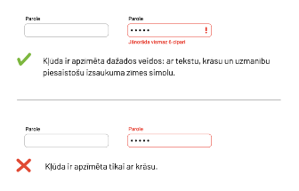
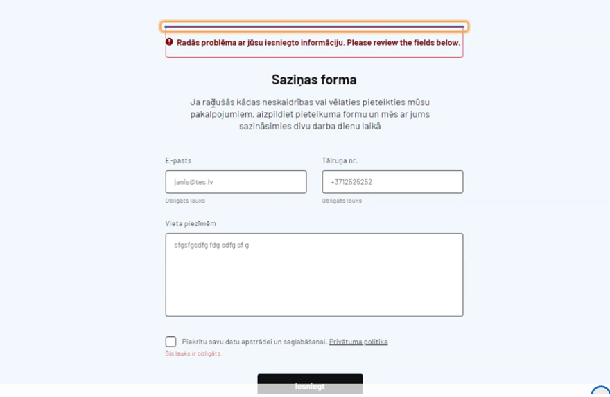

## **4. Formu lauki un kļūdu paziņojumi**

Viens no nozīmīgākajiem tīmekļvietņu uzbūves elementiem, kas nodrošina kvalitatīvu lietotāju mijiedarbību ar to saturu, ir formas – viens vai vairāki lauki, kuros jāievada vai jāatzīmē noteikta informācija, ko vienmēr papildina viena poga, kas ir vērsta uz konkrētu darbību, piemēram: "apstiprināt", "meklēt", "pirkt", "sūtīt" u.c.
Visbiežāk tīmekļvietnē ir sastopamas divas formas: **“meklētājs”** un **“lietotāju autentifikācijas”** rīks. Salīdzināšanai var minēt, ka e-pasta formai ir raksturīgi divi lauki (lietotājvārds un parole) un poga "pierakstīties" (sign in). Taču mēdz būt formas, kuru lauku skaits ir lielāks (piemēram, pasūtījumu noformēšanas formas). Atsevišķos gadījumos (piemēram, elektroniskajās aptaujas anketās) to skaits var sasniegt pat vairākus desmitus.
Lai formu lauki tiktu aizpildīti pareizi, tiem ir jāpievieno instrukcijas. Tomēr šo instrukciju esamība neizslēdz kļūdu iespējamību. Pirmkārt, ne vienmēr ir saprotams, kāda tieši informācija un kurā laukā ir jāievada. Otrkārt, aizpildot formu laukus, var tikt pieļautas drukas kļūdas (cilvēciskais faktors). Un, treškārt, kļūdas informācijas lauku aizpildīšanas brīdī var rasties tīmekļvietnes līmenī (sistēmas kļūdas). Tāpēc lietotāji par visām kļūdām tiek informēti ar īpašu kļūdas paziņojumu palīdzību, kuriem, līdzīgi kā formu laukiem, ir jābūt piekļūstamiem. Piemēram, ja lietotājs vēlas pasūtīt kādu preci, bet pasūtījuma noformēšanas veidlapā pieļauj kļūdu, tieši no tā, cik kvalitatīvs ir kļūdu paziņojums, ir atkarīgs tas, vai viņš pasūtījumu noformēs līdz galam.

### **4.1. Labā prakse**

- Formām un to laukiem jābūt piekļūstamiem ne vien ar datorpeli, bet arī citos alternatīvajos veidos – tikai ar datora tastatūru (plašāka informācija par tastatūra piekļuvi pieejama šo vadlīniju 3. nodaļā), balss ievadi vai ekrāna lasītāju;
- Formu lauku aizpildīšanas instrukcijām ir jābūt ļoti precīzām. Tikpat precīziem ir jābūt arī kļūdu paziņojumiem. Tiem jāparādās katru reizi, kad kādā no laukiem informācija tiek ievadīta nepareizi, lai kļūdas var novērst ātri un efektīvi;
- Lietotājiem ir jānodrošina pietiekami daudz laika formu lauku aizpildīšanai. Piemēram, cilvēki ar redzes traucējumiem, pateicoties ekrāna lasīšanas ierīcēm, digitālo saturu uztver labi un tajā orientējas salīdzinoši ātri. Tomēr pārslēgšanās starp cilnēm un lietotnēm (piemēram, ja kods, kas nepieciešams, lai autorizētos tajā vai citā tīmekļvietnē, tiek nosūtīts uz e-pastu) viņiem var prasīt vairāk laika nekā citiem lietotājiem.

**Ieteikumi piekļūstamu formu lauku veidošanai:**

- Veidojiet īsus, kodolīgus formu lauku nosaukumus, kas skaidri raksturo to mērķi, piemēram: "vārds, uzvārds", "e-pasta adrese", "tālruņa numurs";
- Norādiet formu lauku nosaukumos nepieciešamo informācijas ievadīšanas formātu. Piemēram, datuma ievadīšanas formāts var tikt atspoguļots ļoti dažādi: "datums.mēnesis.gads" formātā "00.00.0000", "mēnesis.datums.gads" formātā "00/00/00", "mēnesis.gads" formātā "00/0000" u.tml.;
- Norādiet, kuri formas lauki ir aizpildāmi obligāti un kuri nē. Izmantojiet šim nolūkam kādu indikatoru, piemēram, zvaigznīti (\*). Šim indikatoram jābūt iekļautam lauka nosaukumā, kas ir iezīmēts konkrētās lapas kodā, vai arī radiopogu un izvēles rūtiņu apzīmējumos. Ja tas būs izcelts tikai vizuāli (piemēram, ar sarkanu krāsu), lietotāji ar redzes traucējumiem šo indikatoru neuztvers;
- Nodrošiniet lietotājiem formu aizpildīšanai optimālu laiku, pirms to sesijas tiek pārtrauktas. Minimālais formas aizpildīšanai paredzētais laiks nedrīkst būt mazāks par 1 minūti;
- Sasaistiet izvēles rūtiņu un radiopogu grupas, izmantojot lauka iestatījumus;
- Ievietojiet lauku vispārējās instrukcijas virs konkrētās formas vai konkrētās sadaļas augšpusē;
- Izkārtojiet formu laukus loģiskā secībā un veidojiet loģisku to navigācijas secību;
- Izmantojiet tā dēvētos "veiksmes paziņojumus" jeb nodrošiniet lietotājiem atgriezenisko saiti. Piemēram, paredziet to, ka uzreiz pēc pogas "meklēt" nospiešanas virs vai zem meklētāja formas parādās informācija par meklēšanas rezultātiem – vai un cik satura vienības, kurās ietverts konkrētais atslēgvārds, tīmekļvietnē ir atrastas. Īpaši svarīga šī atgriezeniskā saite ir gadījumos, kas jāaizpilda apjomīgākas formas, piemēram, aptaujas anketas un pasūtījumu noformēšanas veidlapas. Jo lietotājiem ir jāsaprot, vai anketa ir iesniegta, pasūtījums ir noformēts veiksmīgi u.tml.

**Ieteikumi kļūdas paziņojuma veidošanai:**  
Kļūdas formu laukos tiek apzīmētas trīs veidos: ar īpašiem teksta paziņojumiem, ar izsaukuma zīmi un ar kontrastējošu krāsu (parasti – sarkanu). Lai kļūdu paziņojumus varētu uztvert ikviens lietotājs – arī cilvēki, kuri neatšķir krāsas, tajos nav ieteicams fokusēties tikai uz vienu no kļūdu apzīmēšanas veidiem, piemēram, kontrastējošu krāsu. Ir jākombinē vismaz divi elementi (uzskatāms piemērs, kā veidot kļūdas paziņojumu, atspoguļots piemērā zemāk). Taču ņemiet vērā, ka šie paziņojumi nav jāveido visām kļūdām. Vienkāršākām formām (piemēram, meklēšanas laukam) tie nav nepieciešami.
Ja kļūdu izraisījis cilvēciskais faktors, kļūdas paziņojumā tiek norādīts, kurā laukā un kāda veida kļūda ir pieļauta. Savukārt, ja kļūda ir radusies sistēmā, šajā paziņojumā tiek norādīts, ka konkrētā darbība (piemēram reģistrēšanās noteikta pakalpojuma saņemšanai vai pirkuma noformēšana e-veikalā) nav izdevusies. Turklāt ir svarīgi paredzēt iespēju izlasīt šos paziņojumus gan fiziski (ar acīm), gan ar ekrāna lasīšanas ierīcēm, tāpēc:
Veidojiet šos paziņojumus īsus un koncentrētus.
Iekļaujiet šajos paziņojumos precīzus norādījumus par to, kuros laukos un kādas tieši kļūdas ir fiksētas, kā arī – kā šīs kļūdas novērst. Piemēram, ja nepareizi ir ievadīts datums, laiks vai adrese, kļūdas paziņojumā jābūt norādītam pareizajam šīs informācijas ievades formātam.
Veidojiet kļūdu paziņojumu instrukcijas vienkāršās un viegli uztveramas.
Izvietojiet kļūdas paziņojumu pirms formas, uz kuru tas attiecas, nevis aiz tās.

> **Piemērs**. Kļūdas paziņojuma izveides labās un sliktās prakses piemērs.
> Augšējā attēlā kļūdas paziņojums ir iezīmēts, turklāt vairāk nekā vienā veidā. Turklāt zem kļūdas lauka ir izskaidrota kļūda. Savukārt apakšējā attēlā kļūdas paziņojums ir iezīmēts tikai vienā veidā, turklāt kļūda nav izskaidrota.

Gadījumos, kad tīmekļvietnes formās tiek fiksētas kļūdas, ir svarīgi, lai viss to laukos ievadītais saturs, izņemot sensitīvos datus (piemēram, kredītkaršu numurus), nepazūd arī pēc lapas atjaunināšanas, lai lietotājiem nav jātērē laiks atkārtotai informācijas ievadei.

> **Labās prakses piemērs (pārbaudīts ar ekrāna lasītāju)**. Ekrāna lasītājs nolasa formas lauku nosaukumus, pasaka, kuri ir obligāti aizpildāmi. Ja lauki nav aizpildīti pareizi, lasītājs nolasa kļūdas paziņojumu.

> **Sliktās prakses piemērs (pārbaudīts ar ekrāna lasītāju)**.  
> Šajā gadījumā formas lauks obligāti pieprasa norādīt e-pastu vai lietotājvārdu un paroli (obligāti aizpildāmais lauks atzīmēts ar \*), bet ekrāna lasītājs šo nenolasa.

Tāpat ekrāna lasītājs nenolasa kļūdas paziņojumu – “Nepareizs lietotājvārds vai parole”.

### **4.2. Testēšana**

Formu, lauku nosaukumu un kļūdu paziņojumu pārbaudei atbilstoši piekļūstamības principiem, tiek izmantotas ekrāna lasīšanas ierīces. Piemēram, Google Chrome “Screen Reader”, McOS – “Voice Over”, Windows - NVD. Tā kā formu un lauku nosaukumi datorā un viedtālrunī tiek atspoguļoti līdzīgi, bet navigācija, kas ir būtisks priekšnosacījums, lai piekļūtu formām, tiek atspoguļota atšķirīgi, to testēšana ir jāveic gan datorā, gan viedtālrunī.

**Formu lapu un kļūdu paziņojumu pārbaude interneta pārlūkā Chrome**

**Chrome rīks “Screen Reader”**

1. Pievienojiet <a href="https://chrome.google.com/webstore/detail/screen-reader/kgejglhpjiefppelpmljglcjbhoiplfn" target="_blank">Screen reader</a> rīku kā interneta pārlūka Chrome paplašinājumu. Līdzko tas būs izdarīts, ekrāna lasītājs ieslēgsies automātiski.
2. Atveriet interneta pārlūkā lapu, kuru vēlaties pārbaudīt;
3. Atrodiet tajā visas formas.
4. Pārliecinieties, ka:  
   • visam lapas saturam, tostarp formu laukiem (arī visiem nolaižamo sarakstu vienumiem), var piekļūt ar tastatūru un ekrāna lasītāju. Ekrāna lasītājs atskaņos informāciju par to, kurā vietā tīmekļvietnē tieši jūs atrodaties (piemēram, navigācijas joslā), cik apakšsadaļas ir konkrētajai sadaļai, kā arī secīgi nolasīs formas lauku, kuri konkrētajā brīdī būs fokusā, nosaukumus;
   • katram formas laukam ir nosaukums, turklāt tas ir viegli uztverams un saprotams;
   • izvēlnēs ir iespēja brīvi pārvietoties uz augšu un uz leju, izmantojot tastatūrā iestrādātos bulttaustiņus (←↑↓→);
5. Izvēlieties vienu no formām un aizpildiet to ar tastatūru, pieļaujot kādā no laukiem kļūdas.
6. Pārliecinieties, ka:  
   • formā (virs tās un/vai pie konkrētā formas lauka) parādās kļūdas paziņojums; ar tastatūru un ekrāna lasītāju var piekļūt kļūdas paziņojumam, turklāt ekrāna lasītājs to nolasa pietiekami kvalitatīvi – tā, lai lietotājam, neredzot šo paziņojumu, ir skaidrs, kur un kādas tieši kļūdas ir pieļautas un kā tās izlabot;
   • pēc lapas atjaunošanas formas laukos saglabājas visa korekti ievadītā informācija, izņemot sensitīvos datus.

**Formu lauku un kļūdu paziņojumu pārbaude interneta pārlūkā Safari**

Ja interneta pārlūkā Chrome formu lapu un kļūdu paziņojumu pārbaude tiek veikta ar īpašu rīku, interneta pārlūkā Safari šī piekļūstamības aspekta izvērtēšana tiek veikta ar operētājsistēmā MacOS iebūvēto ekrāna lasītāju:

1. Atveriet tīmekļvietni vai tās sadaļu, ko vēlaties pārbaudīt.
2. Atrodiet tajā visas formas.
3. Aktivizējiet ierīces iestatījumos ekrāna lasītāju: Settings → System Preferences → Accessibility → Voice Over.
4. Pārliecinieties, ka:
   - Visam lapas saturam, tostarp formu laukiem (arī visiem nolaižamo sarakstu vienumiem), var piekļūt ar tastatūru un ekrāna lasītāju. Ekrāna lasītājs atskaņos informāciju par to, kurā vietā tīmekļvietnē tieši jūs atrodaties (piemēram, navigācijas joslā), cik apakšsadaļas ir konkrētajai sadaļai, kā arī secīgi nolasīs formas lauku, kuri konkrētajā brīdī būs fokusā, nosaukumus.
   - Katram formas laukam ir nosaukums, turklāt tas ir viegli uztverams un saprotams.
   - Izvēlnēs ir iespēja brīvi pārvietoties uz augšu un uz leju, izmantojot tastatūrā iestrādātos bulttaustiņus (←↑↓→).
5. Izvēlieties vienu no formām un aizpildiet to ar tastatūru, pieļaujot kādā no laukiem kļūdas.
6. Pārliecinieties, ka:
   - formā (virs tās un/vai pie konkrētā formas lauka) parādās kļūdas paziņojums;
   - ar tastatūru un ekrāna lasītāju var piekļūt kļūdas paziņojumam, turklāt ekrāna lasītājs to nolasa pietiekami kvalitatīvi – tā, lai lietotājam, neredzot šo paziņojumu, ir skaidrs, kur un kādas tieši kļūdas ir pieļautas un kā tās izlabot;
   - pēc lapas atjaunošanas formas laukos saglabājas visa korekti ievadītā informācija, izņemot sensitīvos datus.
