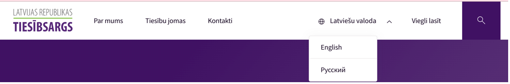
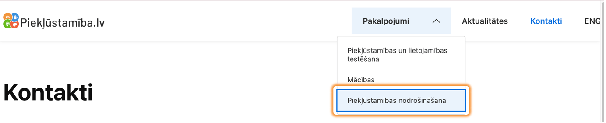
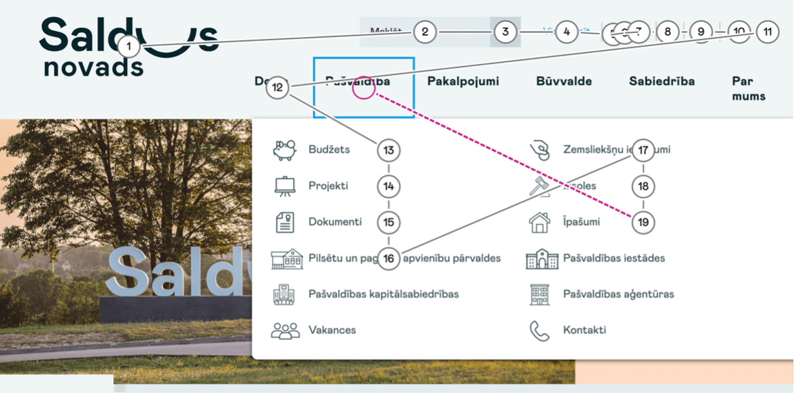

Piekļūstamu navigāciju raksturo vienkāršība – sākot ar navigācijas elementu nosaukumiem un beidzot ar to izvietojumu lapas struktūrā. Piemēram to, cik ērti lietojama ir tīmekļvietne – cik viegli tajā ir orientēties, meklēt informāciju u.tml., nosaka tas, cik pārdomāti ir izveidota tās navigācija.
Bieži tiek pieņemts, ka visiem lietotājiem ir datorpeles un ka visi tās arī lieto. Taču datorpele nav nedz obligāts, nedz arī pašsaprotams digitālā satura izmantošanas instruments. Piemēram, tā var salūzt. Ar to nevar dzēst tekstu. Un ir lietotāji, kuri objektīvu iemeslu dēļ to nemaz nevar izmantot. Starp viņiem ir gan cilvēki ar redzes un kustību traucējumiem (vieni neredz kursoru, otri nespēj to kontrolēt), gan arī cilvēki, kuriem ir pārejošas veselības problēmas (īslaicīgi redzes traucējumi, lauzta roka vai sasists pirksts u.c.). Tāpēc svarīgs priekšnosacījums kvalitatīvas lietotāju un digitālā satura mijiedarbības veicināšanai ir iespēja piekļūt šim saturam vairāk nekā vienā veidā – ne vien ar datorpeli, bet arī dažādām palīgtehnoloģijām.

### **1.1. Labā prakse**

- Lapas navigācija ir **labi strukturēta**, ir **ievērota hierarhija**;
- Galvenajā navigācijā ir izvietoti **līdz 10 elementiem**;
- Navigācijai **var piekļūt bez datora peles** – pārvietoties ar tastatūras TAB taustiņu;
- Galvenās navigācijas **elementu nosaukumi ir saprotami** un viegli lasāmi (tas ir svarīgi, piemēram, izmantojot ekrāna lasītāju);
- Apakšnavigācijas elementi jeb galveno navigācijas sadaļu apakšsadaļas tiek izcelti un nodalīti no galvenā satura (_main content_).

> **Labās prakses piemērs**. Lapas navigācijā var pārvietoties ar TAB taustiņu, navigācijas elementi ir strukturēti, pārskatāmi (pievienoti līdz 10 elementiem) un valodas izvēlnes apakšnavigācijai var piekļūt ar tastatūras taustiņu “Enter”. Galvenās navigācijas elementu nosaukumi ir saprotami un viegli lasāmi.

**Ieteikumi navigācijas veidošanā**:

- Pirmā līmeņa jeb galvenie navigācijas elementi, piemēram, "Par mums", "Pakalpojumi" un "Kontakti", tiek ietverti lapas galvenē (header). Kājenē (footer) un sānu izvēlnēs to izmantošana ir pieļaujama tikai tad, ja tie ir arī galvenē;
- Apakšnavigācijas elementiem tiek nodrošināta piekļuve ne vien ar datorpeli, bet arī tastatūru – izmantojot Tab taustiņu (Tab uz priekšu, Shift + Tab atpakaļ) Apakšnavigācijas elementi parādās uz augšējās sadaļas nospiežot taustiņu "Enter";
- Sānu izvēlnes, līdzīgi kā apakšnavigācijas elementi, tiek nodalītas no galvenā satura;
- Viena no sānu izvēlnēm (parasti – ekrāna kreisajā pusē) tiek veidota kā papildu navigācijas bloks, kurā jāatspoguļo detalizēta lapas struktūra satura rādītāja formā. Šādu risinājumu īpaši novērtē lietotāji ar kognitīviem jeb informācijas uztveres traucējumiem. Taču ikdienā tas sniedz ievērojamas priekšrocības ikvienam lietotājam, jo atvērt nepieciešamo tīmekļvietni uzreiz ir daudz ātrāk un ērtāk nekā "ceļot" pa iznirstošām izvēlnēm vai klikšķināt no saites uz saiti, līdz atveras nepieciešamā lapa.

### **1.2. Testēšana**

#### **1.2.1. Navigācijas pārbaude datorā**

- **Pārvietošanās lapā ar tastatūras TAB taustiņu (neizmantojot datorpeli)**
  Pārbaudiet, vai, pārvietojoties lapā tikai ar TAB taustiņu, piekļūstat visiem galvenās navigācijas elementiem un variet atvērt apakšnavigācijas izvēlnes.

- **Screen reader (Chrome paplašinājums)**

1. Pievienojiet <a href="https://chrome.google.com/webstore/detail/screen-reader/kgejglhpjiefppelpmljglcjbhoiplfn" target="_blank">Screen reader</a> rīku kā interneta pārlūka Chrome paplašinājumu;
2. Atveriet interneta pārlūkā lapu, kuru vēlaties pārbaudīt;
3. Nospiežot TAB taustiņu, rīks iezīmē navigācijas elementu un nolasa nosaukumu;
4. Ar ekrāna lasītāju var pārbaudīt, vai galvenās navigācijas elementi ir nolasāmi, ir aprakstīta apakšnavigāciju izvēlne un norādīts, cik elementu tajā ir iekļauti.

**Piemērs**. Rīks “Screen reader” lapā nolasa galvenās navigācijas elementus, apraksta apakšnavigāciju un norāda elementu skaitu izvēlnē.

- **Accessibility Insights**

1. Ierakstiet interneta pārlūka teksta laukā tīmekļvietnes adresi, kuru vēlaties novērtēt;
2. Aktivizējiet tastatūras piekļuves pārbaudes rīku (Accessibility Insights → TAB Stops ON);
3. Nospiediet datora tastatūrā TAB taustiņu - tukšs aplis iezīmēs elementu, uz kura ir fokuss. Virzoties ar TAB taustiņu tālāk, Jums ekrānā tiks iezīmēts pārvietošanās "ceļš" konkrētajā tīmekļvietnes lapā.
4. Pārliecinieties, ka:

- ar TAB taustiņu var piekļūt visiem tīmekļvietnes navigācijas elementiem un to apakšsadaļām (pārvietošanās pa apakšsadaļu izvēlnēm notiek ar Tab taustiņu (Tab uz priekšu, Shift + Tab atpakaļ);
- kustība pa tīmekļvietni ar TAB taustiņu ir secīga un konkrētās tīmekļvietnes lapas satura izkārtojums ir loģisks;
- vizuālais fokuss ir labi redzams, t.i., katrs navigācijas elements ir izcelts – ierāmēts vai izgaismots (plašāk par tastatūras vizuālo fokusu lasiet šo vadlīniju 3.nodaļā).

> **Piemērs**. Pārvietojoties lapā ar TAB taustiņu redzams, ka navigācijas elementu izkārtojums nav secīgs - nevar piekļūt pie nākamā galvenās navigācijas elementa, ja pirms tam neapskata konkrētā elementa apakšnavigācijas izvēlni.

#### **1.2.2. Navigācijas pārbaude viedtālrunī**

Tīmekļvietnes navigācijas piekļūstamības pārbaude viedtālrunī operētājsistēmās Android un iOS ir līdzīga. Abos gadījumos šī pārbaude tiek veikta ar ierīcē iebūvēto ekrāna lasītāju. Atšķiras tikai izmantojamā rīka nosaukums:

1. Aktivizējiet viedtālruņa iestatījumos ekrāna lasīšanas rīku:
   - Ja izmantosiet pārbaudei viedtālruni ar operētājsistēmu Android, ierīces ekrāna lasītāja aktivizēšanas shēma ir šāda: Settings → Accessibility → Screen Reader → Voice Assistant (pogu var aktivizēt ar dubultklikšķi – pieskaroties tai ar pirkstu divas reizes pēc kārtas).
   - Ja izmantosiet pārbaudei viedtālruni ar operētājsistēmu iOS, ierīces ekrāna lasītāja aktivizēšanas shēma ir šāda: Settings → Accessibility → Voice Assistant (pogu var aktivizēt ar dubultklikšķi – pieskaroties tai ar pirkstu divas reizes pēc kārtas).
2. Atveriet jebkurā no ierīcē pieejamajiem interneta pārlūkiem tīmekļvietni, kuru vēlaties pārbaudīt.
3. Lai pārvietotos pa viedtālruņa ekrānu uz priekšu līdzīgi kā ar TAB taustiņu pa datora ekrānu, velciet ar pirkstu pa ierīces ekrānu (swipe) uz labo pusi. Lai pārvietotos atpakaļ, velciet ar pirkstu pa ierīces ekrānu uz kreiso pusi. Savukārt, lai aktivizētu kādu no tīmekļvietnes navigācijas elementiem, izmantojiet dubultklikšķi (pieskarieties konkrētajam elementam ierīces ekrānā ar pirkstu divas reizes).
4. Pārliecinieties, ka:
   - jūs varat piekļūt visiem navigācijas elementiem, bet īpaši – elementiem, kas atrodas tīmekļvietnes galvenē;
   - jūs varat piekļūt visiem galvenajiem navigācijas elementiem pakārtotajiem elementiem, kas parasti tiek atspoguļoti kā iznirstošas izvēlnes (piemēram, lapas sadaļu apakšsadaļas);
   - vizuālais fokuss ir labi redzams, t.i., katrs navigācijas elements ir izcelts – ierāmēts vai izgaismots (plašāk par tastatūras vizuālo fokusu lasiet šo vadlīniju 3. nodaļā).
