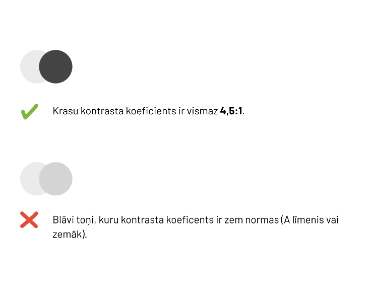
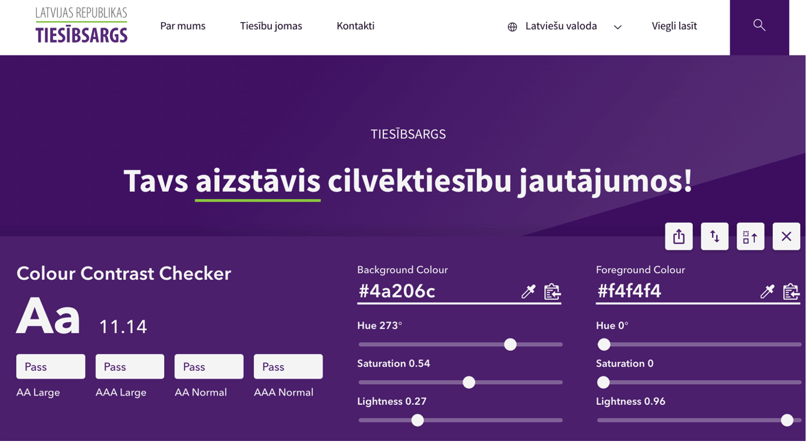
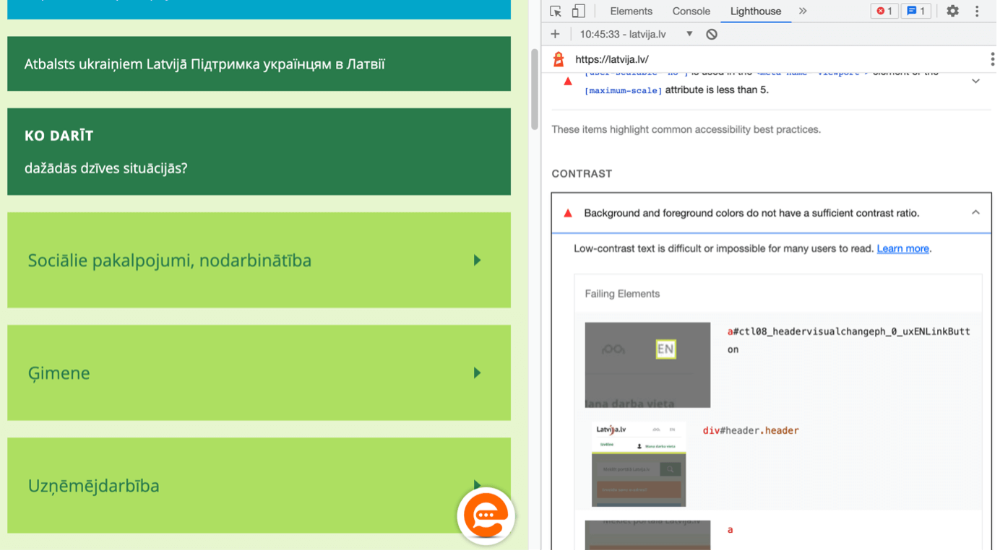
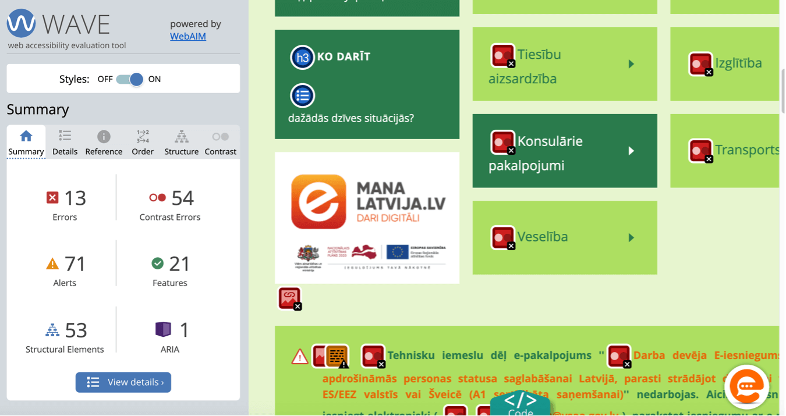
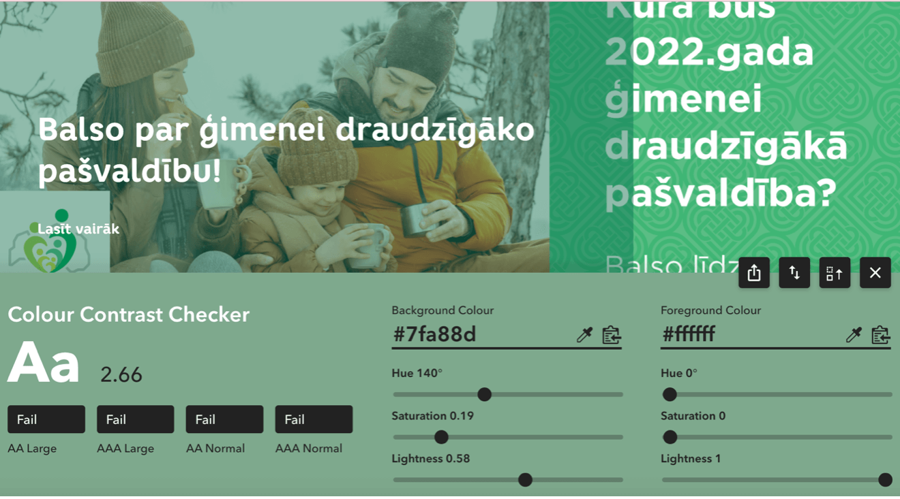

## **7. Krāsu kontrasti**

Viens no galvenajiem tīmekļvietnes saskarnes piekļūstamību raksturojošajiem aspektiem ir krāsu kontrasti jeb vairāk vai mazāk izteiktas teksta un tā fona krāsas atšķirības, kas palīdz uztvert informāciju. Krāsu kontrasts ir attiecība starp tekstu (vai grafiku) un fona krāsu. Lai tīmekļvietnē publicētā informācija būtu piekļūstama, tās noformējumā izmantoto krāsu kontrastam jābūt optimālam. Tas attiecas ne vien uz teksta noformējumu, bet arī uz attēlu kompozīcijām, tīmekļvietnes navigācijas elementu dizainu un citiem vizuāliem elementiem.

Piemēram, gados vecākiem cilvēkiem parasti zūd krāsu kontrastu jutīgums, kas ir raksturīga vājredzīgu cilvēku redzes īpatnība. Tas nozīmē, ka šīs lietotāju grupas labāk uztver informāciju, kuras noformējumā izmantoti augsti krāsu kontrasti, piemēram, klasiskā melnās un baltās krāsas kombinācija. Tajā pašā laikā cilvēkiem, kuri sirgst ar disleksiju (informācijas uztveres traucējumi, kas izpaužas kā grūtības lasīt un uztvert rakstītu tekstu), augsti krāsu kontrasti informācijas uztveri var būtiski apgrūtināt dēļ to spilgtuma. Viņi labāk uztver krāsas, kurām ir augsts krāsu kontrasta koeficients, bet samērīgs krāsu spožuma kontrasts. Piemēram, vidēji brūnas un melnas krāsas kombināciju. Laba lasāmība tīmekļvietnē ir svarīga arī lietotājiem, kuri saturu lasa uz maziem ekrāniem, piemēram, viedtālrunī vai viedpulkstenī, sliktā apgaismojumā un zemas kvalitātes monitoros.

### **7.1. Labā prakse**

Saskaņā ar WCAG vadlīniju AA līmeni:

- Krāsu kontrastam jābūt optimālam;
- Kontrasta attiecība starp standarta teksta krāsu (mazāk nekā 18pt vai mazāk nekā 14pt treknrakstā) un fona krāsu ir vismaz 4,5:1;

  > **Piemērs**. Augšējā attēlā redzams optimāls krāsu kontrasts. Savukārt apakšējā attēlā redzams nepietiekams krāsu kontrasts, jo krāsu toņi ir pārāk līdzīgi. Izmantojot tos teksta un tā fona noformējumam, digitālais saturs kļūs nepiekļūstams noteiktām lietotāju grupām.

- Kontrasta attiecība starp liela izmēra (lielāka vai vienāda ar 18pt vai lielāka vai vienāda ar 14pt treknrakstā) un fona krāsu ir vismaz 3:1;
- Siltās un aukstās krāsas veido vislabāko krāsu kontrastu.

> Labās prakses piemērs. Krāsu kontrasta attiecība šajā gadījumā ir 11:14. (balti burti uz tumši violeta fona), kas ir atbilstoša gan standarta burtu izmēram, gan lielākam.

**Papildu ieteikumi**:

- Izvietojot tekstu uz attēla (piemēram, reklāmas plakāta), izmantojiet tam papildu fona krāsu, kas ir vienkrāsaina. Šādi jūs panāksiet labāku kontrastu, kā arī vairāk izcelsiet vēlamo vēstījumu;
- Pietiekamu krāsu kontrastu var panākt ne tikai ar melnu un baltu krāsu. To nodrošina arī tādas krāsu kombinācijas kā zila ar baltu un dzeltena ar melnu;
- Izvairieties no tā, ka funkcionalitātes vai nozīmes piešķiršanai tiek izmantota tikai krāsa. Piemēram, tīmekļvietnē ievietojot hipersaiti bez pasvītrojuma (izceļot tikai ar krāsu). Lietotāji ir pieraduši redzēt, ka saites ir pasvītrotas;
- Ja tas ir iespējams, izstrādājiet papildu vizuālos norādījumus, kas palīdz saprast tīmekļvietnes funkcionalitāti cilvēkiem, kuri krāsas redz citādi. Kombinējiet krāsu ar formām, izmēriem, simboliem vai tekstu;
- Pievērsiet papildu uzmanību pogu, saišu un izvēlņu krāsu kontrastam, jo tie ir tīmekļvietnes navigācijas līdzekļi;
- Neizvietojiet tekstu un attēlus uz raiba fona. Šajā gadījumā par raibu fonu tiek uzskatīts jebkāds fons, kas nav vienkrāsains. Tas attiecas arī uz fonu, kura noformējumā tiek izmantotas tā dēvētās "ūdenszīmes" jeb teju caurspīdīgi dizaina elementi, kas var šķist gluži nemanāmi, taču var ietekmēt uz tām publicētās informācijas uztveri;
- Izvairieties tekstu noformējumā no blāviem krāsu toņiem (gaiši pelēka krāsa, pasteļtoņi u.tml.), jo tie saplūst ar fonu, tāpēc satura uztvere var būt apgrūtināta ikvienam lietotājam – arī tiem, kuriem nav redzes un informācijas uztveres traucējumu;
- Izvairieties no tādām teksta un fona krāsu kombinācijām kā zaļš ar sarkanu un zils ar dzeltenu.

### **7.2. Testēšana**

Krāsu kontrasta pārbaudei izmanto gan manuālos, gan automātiskos testēšanas rīkus. Krāsu kontrasta pārbaudi sāk ar automātisko testu, lai konstatētu, vai lapā ir krāsu kontrasta problēmas.

Automātiskie testēšanas rīki

**Lighthouse** (Chrome, Edge; pieejams arī kā Chrome un Firefox paplašinājums):

1. Atveriet Google Chrome pārlūkā tīmekļa lapu, kuru vēlaties pārbaudīt;
2. Ar peles labo pogu noklikšķiniet uz ekrāna un izvēlieties "Inspect" (Pārbaudīt);
3. Izvēlieties cilni "Lighthouse", atzīmējiet, ko vēlaties analizēt un nospiediet "Analyze page load".

> **Piemērs**. Pārbaude ar Lighthouse rīku parāda, ka teksta un fona krāsu attiecība nav atbilstoša, norādot un iezīmējot arī konkrētās krāsu kļūdas.

**Wave**
rīks ir vairāk piemērots tā dēvēto "slēgto" jeb ar parolēm aizsargāto tīmekļvietņu testēšanai.
Wave rīka lietošana:

1. Pievienojiet Wave rīku kā Chrome, Firefox vai Edge paplašinājumu;
   Ierakstiet interneta pārlūka teksta laukā tīmekļvietnes adresi, kuru vēlaties novērtēt;
2. Uzklikšķiniet uz Wave rīka ikonas interneta pārlūka spraudņu izvēlnē;Ekrāna kreisajā pusē atvērsies logs, kurā būs atspoguļota informācija par to, cik tieši krāsu kontrastu kļūdas konkrētajā tīmekļvietnes lapā (nevis visā tīmekļvietnē) ir fiksētas. Savukārt pašā tīmekļvietnē pie katras no kļūdām parādīsies maza ikona sarkana kvadrāta formā;
3. Izvēlieties iepriekšējā punktā minētā loga izvēlnē sadaļu Detaļas (Details). Arī šeit parādīsies mazas ikonas sarkana kvadrāta formā. To skaits būs vienlīdzīgs ar lapā reģistrēto kontrastu kļūdu skaitu. Uzklikšķinot uz jebkuras ikonas šajā logā, tīmekļvietnes lapā tiks iezīmēta ar to saistītā ikona, tā norādot, kurā tieši vietā tieši atrodas saturs, kuram nav pietiekams kontrasts;
4. Pārliecinieties, ka:
   - tīmekļvietnē publicētās satura krāsu kontrasta koeficients ir vismaz 4,5:1;
   - šis krāsu kontrasta koeficients ir izmantots ne vien dažādu aprakstu, bet arī galvenē un kājenē atspoguļotās informācijas, ikonu, navigācijas elementu un citas tekstuālas informācijas noformēšanai.

> **Piemērs**. Krāsu kontrasta pārbaude ar Wave rīku. Kreisajā lapas pusē tiek parādītas konstatētās problēmas, t.sk. krāsu kontrasta.

**Manuālie testēšanas rīki**

Manuālos pārbaudes rīkus izmanto sekojošos gadījumos:

- Pēc automātiskās pārbaudes, ja tiek konstatētas kontrastu problēmas;
- Ja teksts ir novietots virsū attēlam;
- Ja vēlas veikt kontrasta uzlabojumus konkrētā lapā

**Colour Contrast Checker**

1. Pievienojiet <a href="https://chrome.google.com/webstore/detail/colour-contrast-checker/nmmjeclfkgjdomacpcflgdkgpphpmnfe" target="_blank">Colour Contrast Checker</a> kā interneta pārlūka Chrome paplašinājumu;
2. Atveriet tīmekļa lapu, kuru vēlaties pārbaudīt;
3. Uzklikšķiniet uz Colour contrast checker rīka ikonas interneta pārlūka spraudņu izvēlnē;
4. Uz atvērtā rīka, uzspiediet uz fona krāsas ikonas un novietojiet to uz lapas fonu, kuru vēlaties pārbaudīt;
5. Uzspiediet uz teksta krāsas ikonas un novietojiet to uz teksta krāsas, kuru vēlaties pārbaudīt;
6. Rīks nosaka un parāda kontrasta attiecību (piemērā Nr. kontrasta attiecība ir 2.66, kas nav pietiekama);
7. Kontrasta uzlabošanai var izmantot rīka funkciju “Lightness” un manuāli pielāgot atbilstošu kontrasta attiecību (piemēram, šajā gadījumā padarot tumšāku fona krāsu).

> **Piemērs**. Krāsu kontrasta attiecība 2.66 nav pietiekama ne standarta, ne liela izmēra tekstam (pārbaude veikta ar baltas krāsas burtiem uz raibā fona gaišākās daļas).

