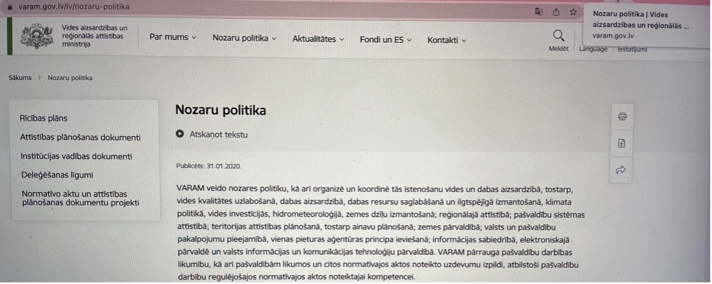
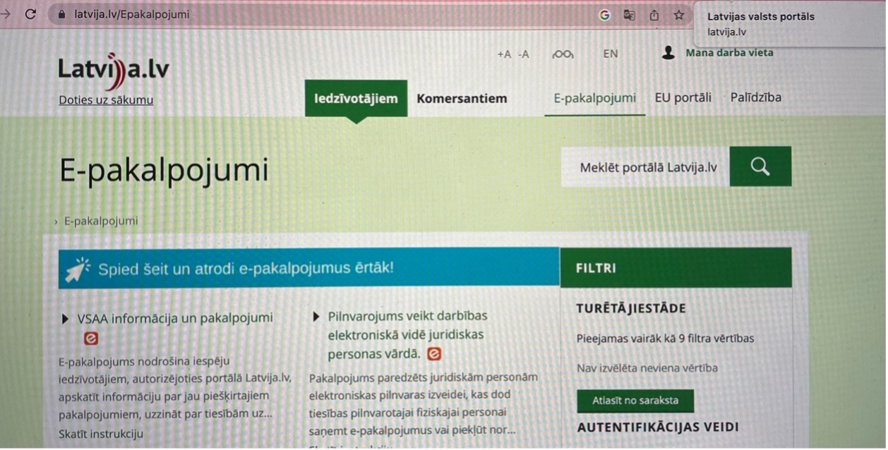
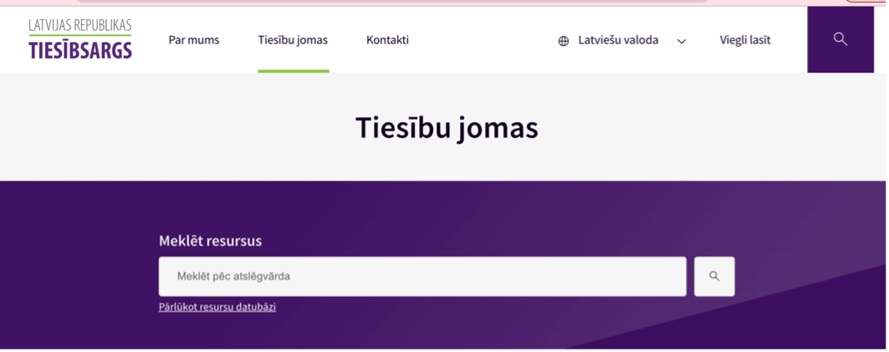

## **9. Lapu nosaukumi**

Nosaukums bieži vien ir pirmais, ko cilvēki redz vai dzird, atverot jaunu tīmekļvietnes lapu vai sadaļu. Tas palīdz cilvēkiem orientēties tīmekļa vietnēs un lietotnēs. Īpaši noderīgi tas ir lietotājiem ar redzes traucējumiem (t.sk. ar lasīšanas vai kognitīviem traucējumiem), kuri nevar uzreiz uztvert visu lapu/ekrānu. Tīmekļvietnes lapu nosaukumiem ir jābūt unikāliem – tie nevar atkārtoties. Pareizi veidoti tīmekļvietņu lapu nosaukumi būtiski uzlabo organizācijas rezultātus Google meklētājā.

### **9.1. Labā prakse**

- Veidojiet **lapu nosaukumus īsus un kodolīgus**, precīzi raksturojot to saturu un mērķi;
- Pārliecinieties, ka **lapu nosaukumi ir unikāli** jūsu tīmekļvietnei un visām ar to saistītajām vietnēm – tie neatkārtojas;
- Iekļaujiet lapas nosaukumu sākumā, bet tīmekļvietnes un/vai organizācijas, kurai tā pieder, nosaukumu – beigās.
  Piemērs:
  - Par mums | VARAM tīmekļvietne
  - Aktualitātes | VARAM tīmekļvietne
  - Administratīvi teritoriālā reforma | VARAM tīmekļvietne
- Ievērojiet lapu nosaukumu izveidē **vienotu stilu**. Piemēram, atdalot iepriekš aprakstīto primāro un sekundāro informāciju, izmantojiet visos lapu nosaukumos vienu un to pašu simbolu – domuzīmi vai vertikālu svītru nevis katrā lapā citu simbolu. Tas pats attiecas arī uz organizācijas, kurai konkrētā tīmekļvietne pieder, nosaukuma rakstību. Proti, rakstiet šo nosaukumu visur vienādi, piemēram, "VARAM tīmekļvietne" (kā iepriekšējā punktā aprakstītajā piemērā) vai "www.varam.gov.lv", vai "Vides aizsardzības un reģionālās attīstības ministrija", nevis katrā lapas nosaukumā citādi.
  Iekļaujiet lapu, kas veidotas kā daudzpakāpju procesa daļa (piemēram, reģistrēšanās pakalpojuma saņemšanai vai pasūtījuma noformēšana) vai kādas sadaļas apakšsadaļa, nosaukumā konkrētā procesa vai soļa, kas tajās aprakstīts, nosaukumu. Piemēram:
  Iedzīvotāju pieteikumu izskatīšana ministrijas kompetences jomās | Pakalpojumi | VARAM tīmekļvietne
  Līgums | Izveido eParaksts Mobile | eparaksts.lv
  Ievērojiet tīmekļvietņu lapu nosaukumu izveidē izvēlēto valodu pareizrakstības likumus.
- Ievērojiet lapu nosaukumu izveidē **vienotu stilu**. Piemēram, atdalot iepriekš aprakstīto primāro un sekundāro informāciju, izmantojiet visos lapu nosaukumos vienu un to pašu simbolu – domuzīmi vai vertikālu svītru (kā iepriekšējā punktā aprakstītajā piemērā), nevis katrā lapā citu simbolu. Tas pats attiecas arī uz organizācijas, kurai konkrētā tīmekļvietne pieder, nosaukuma rakstību. Proti, rakstiet šo nosaukumu visur vienādi, piemēram, "VARAM tīmekļvietne" (kā iepriekšējā punktā aprakstītajā piemērā) vai "`www.varam.gov.lv`", vai "Vides aizsardzības un reģionālās attīstības ministrija", nevis katrā lapas nosaukumā citādi.
- Iekļaujiet lapu, kas veidotas kā daudzpakāpju procesa daļa (piemēram, reģistrēšanās pakalpojuma saņemšanai vai pasūtījuma noformēšana) vai kādas sadaļas apakšsadaļa, nosaukumā konkrētā procesa vai soļa, kas tajās aprakstīts, nosaukumu. Piemēram:
  - Iedzīvotāju pieteikumu izskatīšana ministrijas kompetences jomās | Pakalpojumi | VARAM tīmekļvietne
  - Līgums | Izveido eParaksts Mobile | `eparaksts.lv`
- Ievērojiet tīmekļvietņu lapu nosaukumu izveidē izvēlēto valodu pareizrakstības likumus.

> **Labās prakses piemērs**. Attēlā lapas nosaukums sākas ar tās virsrakstu, kuram seko organizācijas nosaukums:
> Nozaru politika| Vides aizsardzības un reģionālās attīstības ministrija.

> **Sliktās prakses piemērs**. Lapas nosaukumā ir redzama tikai informācija par pašu tīmekļvietni un tās adrese – Latvijas valsts portāls, latvija.lv. Pareizi noformēts lapas nosaukums būtu šāds: E-pakalpojumi | Latvijas valsts portāls.

### **9.2. Testēšana**

Tīmekļvietņu lapu nosaukumu atbilstība piekļūstamības principiem tiek pārbaudīta vizuāli:

1. Atveriet tīmekļvietni vai tās sadaļu, ko vēlaties pārbaudīt;
2. Pārliecinieties, ka lapas nosaukums, kas pēc noklusējuma parādīsies jūsu izvēlētā interneta pārlūka loga virsrakstjoslā vai cilnē, atbilst 9.1. punktā aprakstītajiem labās prakses piemēriem.

**Piemērs**. Tīmekļvietnes lapas nosaukums:
Par mums – Tiesībsargs  
Tiesību joma – Tiesībsargs

