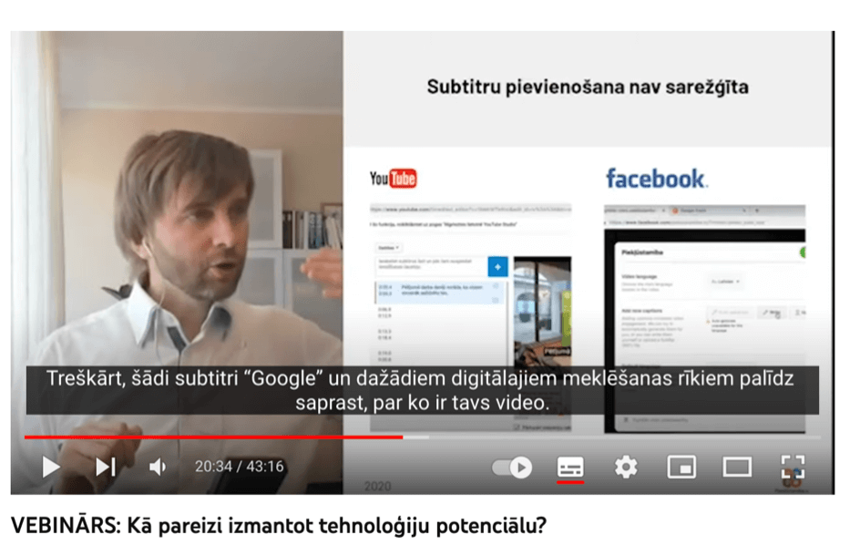
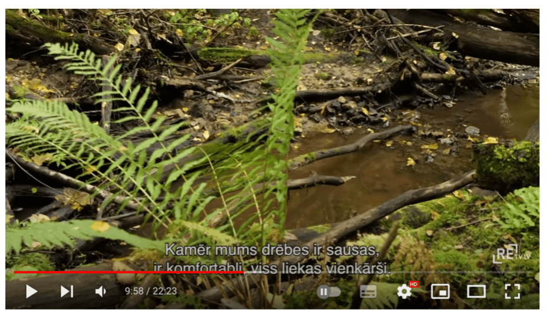

Multimediju saturam ir jābūt piekļūstamam dažādām lietotāju grupām. Piemēram, nedzirdīgiem un vājdzirdīgiem cilvēkiem ir svarīgi, ja audio vai video saturam tiek nodrošināti subtitri, teksta noraksts un/vai vispārīgs apraksts teksta formātā. Arī cilvēki ar redzes traucējumiem var saskarties ar ierobežojumiem. Pirmkārt, nereti video materiāli tiek veidoti bez balss ieraksta, lai gan tajos var tikt atspoguļota būtiska informācija. Otrkārt, ja video materiālam ir skaņa, ierunātu tekstu (piemēram, dialogus) cilvēki ar redzes traucējumiem var uztvert ļoti labi, bet video noskaņu – tikai daļēji. Taču tādam video saturam kā filmas un TV raidījumi noskaņai ir ļoti nozīmīga loma. Un to neredzīgiem un vājredzīgiem cilvēkiem var nodot, izmantojot teksta norakstu (jo to var izlasīt ekrāna lasīšanas ierīces) vai ar audio aprakstu (jo to var noklausīties).

### **11.1. Multimediju satura alternatīvu veidi**

Kopumā izšķir trīs veidu multimediju satura alternatīvas: **subtitri, teksta noraksts** un **audio apraksts**. Lai gan visiem alternatīvajiem audio un video satura atspoguļojuma veidiem ir vienots mērķis – padarīt multimediju saturu piekļūstamu (saprotamu un viegli uztveramu) ikvienam lietotājam, to noformējumā ir jāņem vērā zināmas nianses.

#### **11.1.1. Subtitri (_subtitles, captions_)**

Subtitri ir detalizēts video (konferenču, videoklipu, filmu, TV raidījumu, videospēļu u.tml.) satura atšifrējums oriģinālvalodā un/vai kādā no svešvalodām.

**Subtitru veidi:**

- **Atvērtie subtitri** (_open captions, burned in captions, baked on captions_) tiek iestrādāti jeb "iededzināti" video materiālā attēla formātā, tāpēc tie nav piekļūstami:
  - tos nevar ieslēgt un izslēgt, kā arī nolasīt ar ekrāna lasīšanas ierīcēm;
  - tie nepielāgojas ierīces ekrāna izmēram.

Lai arī atvērtie subtitri var būt vizuāli pievilcīgāki par slēgtajiem (jo tiem var veidot dažādus dizainus), tie arī nav praktiski un finansiāli izdevīgi. Pirmkārt, šādu subtitru izveide maksā dārgāk. Otrkārt, ja tajos tiek konstatētas kļūdas, labojumi ir jāveic visā video failā. Piemēram, ja kļūdas tiek konstatētas publiskotam video, kam jau ir noteikts skatījumu skaits, video ir jādzēš, jāizlabo un jāpublicē no jauna (uzskatāms atvērto subtitru piemērs atspoguļots 15. attēlā).

- **Slēgtie subtitri** (_closed captions_) tiek veidoti kā atsevišķs fails, izmantojot šim nolūkam īpašus rīkus, ko piedāvā tādas platformas kā Facebook, YouTube, Vimeo u.c. (uzskatāms šādu subtitru piemērs atspoguļots 14. attēlā). Šādu subtitru galvenās priekšrocības:

  - tos var ieslēgt un izslēgt, izmantojot pogu, kas tiek apzīmēta ar diviem burtiem – "CC" (abreviatūra no angļu valodas termina closed captions);
  - tie pielāgojas ierīces ekrāna izmēram;
  - tos var veidot gan tiešsaistē, gan arī augšupielādēt kā atsevišķu failu (populārākie subtitru faila paplašinājumi ir SRT un SBV);
  - tos var lejupielādēt (lieti noder, veidojot teksta norakstu – plašāka informācija par tā izveides mērķiem un principiem pieejama 11.1.2. punktā);
  - tos var izveidot jebkurā brīdī (tie nav jāpublicē uzreiz kopā ar video);
  - tajos fiksētās kļūdas var izlabot labot jebkurā brīdī, turklāt tiešsaistē (izmaiņas tiek veiktas tikai subtitros, nevis visā video failā).

- **Automātiskie subtitri** (_automatic subtitles_) tiek veidoti ar mašīnlasīšanas un balss atpazīšanas tehnoloģijām. Tie ir sastopami vairākās digitālajās platformās, piemēram, YouTube (pieejami tikai video saturam, kas ir angļu valodā) un Google Meet. Šie subtitri nav piemēroti video satura piekļūstamības nodrošināšanai, jo nav precīzi. Taču tos var efektīvi izmantot kā pamatu atvērto un slēgto subtitru izveidei.

#### **11.1.2. Teksta noraksts (_transcript_)**

Tas ir multimediju satura attēlojums teksta formātā, kas tiek publicēts uzreiz zem konkrētā ieraksta. Lai gan audio un video materiālu teksta norakstiem ir vienots mērķis – palīdzēt lietotājiem labāk tajos labāk orientēties, uztvert to saturu, šo materiālu teksta noraksta izveides principi nedaudz atšķiras.

Video faila teksta noraksts ir detalizēts tā satura atšifrējums. Parasti tajā tiek dublēts viss subtitru saturs, izņemot laika kodus, kas lietotājiem ļauj gūt visai konkrētu priekšstatu par video faila saturu, to neskatoties. Lai arī šī video satura alternatīva primāri ir paredzēta cilvēkiem ar redzes traucējumiem, to novērtē arī citi lietotāji. Piemēram, cilvēki, kuriem ir jāapstrādā liels informācijas apjoms, meklējot tīmeklī materiālus par viņiem saistošām tēmām. Ja viņiem aktuālie atslēgvārdi būs iekļauti jūsu video teksta norakstā, ir ļoti liela iespēja, ka meklēšanas platforma (piemēram, Google vai Yandex) piedāvās šo video kā vienu no atlasītājiem resursiem.

Savukārt audio faila teksta noraksts ir jēgpilns tā satura apraksts jeb atstāstījums teksta formātā, kas parasti tiek izmantots radio raidījumu un podkāstu piekļūstamības nodrošināšanai. Audio failiem, kas laika ziņā pārsniedz 10 līdz 15 minūtes, parasti tiek veidoti vispārīgi apraksti, iekļaujot vien būtiskāko informāciju, runaspersonu citātus. Bet īsākiem audio failiem tie var būt arī ļoti detalizēti – teju kā video failu teksta noraksti.

#### **11.1.3. Audio apraksts (_audio description_)**

Tas ir video satura apraksts audio formātā, kura mērķis ir palīdzēt cilvēkiem ar redzes traucējumiem uztvert konkrētā video kontekstu. Parasti šādus aprakstus izmanto filmām – atskaņojot filmu, ir dzirdamas ne vien visas oriģinālās skaņas (dialogi, trokšņi, mūzika u.c.), bet arī balss, kura fonā stāsta par to, kas konkrētajā brīdī notiek ekrānā.

Šādus aprakstus īpaši ieteicams veidot video materiāliem, kuriem skaņa nav paredzēta. Piemēram, tā dēvētajiem noskaņas video, kas nereti tiek izmantoti, veidojot dažādu pasākumu atskatus. Šajā gadījumā ir īsi jāizstāsta video redzamās lietas, darbības utt., lai cilvēkam, kurš to neredz, rodas aptuvens priekšstats par to, kas tajā atspoguļots.

Raugoties no tehniskā viedokļa, audio apraksts ir alternatīvais video ieraksta skaņu celiņš. Tas var būt iekļauts video failā kā atsevišķs skaņu celiņš vai arī publicēts kā atsevišķs audio faila pielikums. Piemēram, YouTube platformā ir atsevišķs spraudnis, kas ļauj pievienot šādu pielikumu.

Jāpiebilst, ka fokusēties piekļūstama multimediju satura izveidē tikai uz lietotājiem ar redzes un dzirdes traucējumiem nevar. Piemēram, pieredze liecina, ka lietotāji bez šādiem traucējumiem subtitrus izmanto ievērojami biežāk nekā lietotāji ar tiem. Iemesls – ir virkne situāciju, kad video saturu ikdienā lietot ir apgrūtinoši un pat neiespējami, piemēram, fona trokšņi, atrašanās publiskās vietās, izlādējušās austiņas, bērni ar trauslu miegu, runaspersonu akcents, multimediju satura oriģinālās valodas nepārzināšana u.c.

### **11.2. Labā prakse**

Labā prakse paredz, ka jebkuram audio un video materiālam, kas tiek publicēts digitālajā vidē, nepieciešama vismaz viena satura alternatīva. Visbiežāk izmantotais risinājums video materiālu piekļūstamības nodrošināšanā ir subtitri, ko papildina īss, vispārīgs apraksts (pieteikums), lai radītu lietotājiem priekšstatu par tā saturu.
Ja video ieraksts ir garš (sākot no 30 min), šos aprakstus ieteicams papildināt ar vispārīgu tā satura plānu, norādot galvenās tēmas, kas tiek atspoguļotas video materiālā, kā arī aptuveno sākuma laiku katrai no šīm tēmām (šo pašu taktiku ieteicams izmantot arī audio failiem). Tas lietotājiem palīdzēs labāk orientēties video saturā.

**Labās prakses ieteikumi piekļūstamu subtitru veidošanā**:

- Veidojiet slēgtos, nevis atvērtos subtitrus. Ja subtitri iestrādāti video materiālā attēla formātā, ekrāna lasīšanas ierīces tos izlasīt nevar. Arī dažādās meklēšanas platformās (Google, Yandex u.c.) šādiem video ir zemāki rezultāti.
- Lieciet subtitrus tā, lai to sākums un beigas sakrīt ar balss tekstu. Taču ņemiet vērā, ka minimālais subtitru atrādīšanas laiks ir 1,5 sekundes.
- Norādiet visas runaspersonas – arī fona balsi. Piemēram: "Jānis Bērziņš: Savu karjeru sāku kā skolotājs.", "(Ilze) Kā nodrošināt pakalpojuma pieejamību?" vai ">>Eksperts: Šogad nozarē plānots rekordliels eksporta apjoma pieaugums."
-     Iekļaujiet subtitros informāciju par izteiksmīgiem žestiem (ja tiem ir nozīme) un papildu skaņām, lai veiksmīgāk nodotu video noskaņu, liekot šo informāciju parastajās iekavās vai kvadrātiekavās. Piemēram: (skolotāja nopūšas), [skan dramatiska/priecīga mūzika], (ministrs noplāta rokas) u.tml.
- Atšifrējiet video izmantotos dziesmu vārdus. Lai norādītu, ka skan dziesma (fonā vai kāds no video varoņiem dzied), izmantojiet simbolus – notis vai mirkļbirkām raksturīgo režģi. Piemēram: Paņem savus alvas zaldātiņus, nāc uz manām trepēm spēlēties  vai # Nāk rudens apgleznot Latviju, bet nepūlies, necenties tā #.
- Rakstiet skaitļus līdz desmit ar vārdiem, bet lielākus – ar cipariem. Piemēram: "Ministram šodien ieplānotas trīs vizītes.", "Vairāk nekā 70% pasaules tīmekļvietņu nav piekļūstamas.".
- Izmantojiet lielos burtus pēc piederības – sākot teikumu, rakstot īpašvārdus u.tml. Noteiktu vārdu, teikumu izcelšana ar lielajiem burtiem nav vēlama, bet ir pieļaujama vien tikai, lai norādītu uz kliegšanu.
- Neizmantojiet subtitriem vairāk par divām teksta līnijām. Un ņemiet vērā, ka optimālais zīmju skaits vienā līnijā ir 32.
- Veidojiet subtitrus no vienkāršiem nepaplašinātiem un vienkāršiem paplašinātiem teikumiem. Izvairieties no liekvārdības, pareizrakstības un gramatikas kļūdu.
- Izvairieties no svešvārdiem, slenga, idiomām u.tml. – iespēju robežās aizstājiet šos vārdus, frāzes ar vienkāršākiem sinonīmiem, jo cilvēkiem ar dzirdes traucējumiem var būt grūtības uztvert to nozīmi.
- Iekļaujiet subtitros visu vizuālo informāciju, kas tiek izmantota video noformējumā: video nosaukums, runaspersonu vārdi, uzvārdi un amati, fakti un dati, atziņas u.c. Ja šīs informācijas apjoms ir pārāk liels, tāpēc pārējo subtitru sākums un beigas nesakrīt ar balss tekstu un/vai nav iespējams nodrošināt minimālo subtitru atrādīšanas laiku, iekļaujiet šo teksta norakstā.
- Izvairieties no spēcīgu krāsu, piemēram, sarkanas vai zaļas, izmantošanas. Vislasāmākie subtitri ir baltā krāsā ar melnu fonu, kas pielāgojas visiem iestatījumiem.
- Nav ieteicams izmantot multimediju satura automātiskās atskaņošanas funkciju – audio un video ierakstu skaņai nav jāieslēdzas, līdzko tiek atvērta tīmekļvietnes lapa vai sadaļa, kurā tie ir publicēti. Tāpēc galvenās vadīklas, kurām jābūt iezīmētām multimediju satura atskaņotājos, ir:
  - vadīkla, kas ļauj apturēt vai aizvērt ierakstu jebkurā brīdī;
  - vadīkla, kas ļauj regulēt ieraksta skaļumu
- “Slēgto subtitru” veidošanai latviešu valodā izmantojiet platformu Hugo.lv – augšupielādējiet jau ierunātu audio/video failu vai diktējiet runu. Atpazītā runa tiek pārvērsta rakstītā tekstā, ko pēc tam variet pievienot multimediju atskaņošanas platformās, piem. Youtube.

> **Labās prakses piemērs**. Attēlā redzami “slēgtie subtitri”, kuri pievienoti platformā Youtube. Subtitrus jebkurā brīdī var ieslēgt/izslēgt, rediģēt to fonta krāsu un izmēru. Krāsu kontrasts subtitriem ir optimāls.

> **Sliktās prakses piemērs**. Attēlā redzams Youtube platformā pievienots video ar "atvērtiem" subtitriem, kas ir iestrādāti konkrētajā video materiālā. Krāsu kontrasts nav optimāls, tāpēc tos ir grūti salasīt. Ja subtitros būtu jāveic labojumi, video no tīmekļvietnes un/vai YouTube platformas būtu jādzēš un pēc tam jāpublicē no jauna. Turklāt, ja video neieslēdz pilnekrāna režīmā, video laika josla apgrūtina to pilnvērtīgu lasāmību.

### **11.3. Testēšana**

Lai noskaidrotu, vai izmantotās multimediju satura alternatīvas atbilst piekļūstamības principiem, jums ir jāpārbauda trīs lietas:

- tastatūras piekļuve;
- multimediju satura kontroles mehānismi;
- subtitru kvalitāte.

#### **11.3.1. Tastatūras piekļuves pārbaude**

Tās mērķis ir pārliecināties, ka visas multimediju atskaņotāja vadīklas ir iezīmētas un piekļūstamas ar tastatūru. Lai to izdarītu, sekojiet līdzi šo vadlīniju 3. nodaļas 3.2. punktā aprakstītajiem soļiem.

#### **11.3.2. Multimediju satura kontroles mehānismu pārbaude**

Tās primārais mērķis ir pārliecināties, ka audio un video saturs, atverot tīmekļvietni, kurā tas publicēts, netiek atskaņots automātiski (īpaši raksturīgi tas ir reklāmām un tīmekļvietņu sākumlapas noformējumā ietvertajiem video). Tāpēc:

1. Atveriet jebkuru jūsu organizācijas tīmekļvietnē publicēto audio vai video ierakstu.
2. Pārliecinieties, ka multimediju atskaņotājā ir iezīmētas tā satura kontroles vadīklas, kas ļauj aizvērt ierakstu un regulēt tā skaļumu. Savukārt, ja audio vai video saturs tiek atskaņots automātiski – līdzko tiek atvērta tīmekļvietnes sadaļa, kurā tas publicēts, pārliecinieties, ka ieraksts apstājas pēc 3 sekundēm.
3. Papildus varat pārbaudīt, vai ir iespēja regulēt audio vai video ieraksta atskaņošanas ātrumu. Lielākajā daļā atskaņotāju (piemēram, YouTube) to var mainīt iestatījumos. Uzklikšķiniet uz ikonas atskaņotāja labajā apakšējā stūrī, kas vizuāli atgādina zobratu. Izvēlieties izvēlni Atskaņošanas ātrums (Playback Speed). Pārliecinieties, ka papildu izvēlnē, kas atveras, ir audio un video satura atskaņošanas ātruma maiņas iespējas (vienumi līdz 1 ļauj palēnināt atskaņošanas ātrumu, bet vienumi virs 1 – paātrināt).

#### **11.3.3. Subtitru kvalitātes pārbaude**

Lai pārbaudītu subtitru kvalitāti, vispirms ir jāpārliecinās, ka tie konkrētajam video ir pievienoti:

1. Atveriet jebkuru jūsu organizācijas tīmekļa vietnē publicēto video materiālu.
2. Ja tam uzreiz parādās subtitri, pārbaudiet, kāda veida subtitri tie ir – atvērtie, slēgtie vai automātiskie:
   - Nospiediet video loga rīkjoslā pogu "CC". Ja subtitri nepazūd, tie ir atvērti. Tāpat atvērtajiem subtitriem fonā var nebūt kontrastējoša krāsas līnija, kas ir tipiska slēgto subtitru iezīme.
   - Palieliniet video pa visu ierīces ekrānu. Ja subtitri pielāgojas ekrāna izmēram, tie ir slēgti. Īpaši uzskatāmi šī atšķirība ir redzama viedtālruņa ekrānā, tāpēc iestatiet datorā viedtālruņa skatījuma režīmu. Šim nolūkam nospiediet taustiņu kombināciju Ctrl + Shift + C. Ekrāna labajā pusē atvērsies logs. Nospiediet tā rīkjoslā uz ikonas, kurā attēloti divi dažādu izmēru kvadrāti. Tagad jūs varat novērtēt, kā subtitri izskatās video ierakstos, kas tiek atskaņoti viedtālrunī.
   - Ja subtitri parādās burtu pa burtam vai vārdu pa vārdam, nevis kā pilns teikums, un šķiet neloģiski, tie ir automātiski.
3. Ja subtitri neparādās uzreiz, iespējams, jums tie nav aktivizēti. Nospiediet video loga rīkjoslā pogu "CC". Ja subtitri neparādās, to nav. Savukārt, ja subtitri pēc šīs pogas nospiešanas parādās, pārliecinieties, ka tie ir izveidoti atbilstoši 11.2. punktā aprakstītajiem labās prakses principiem.
