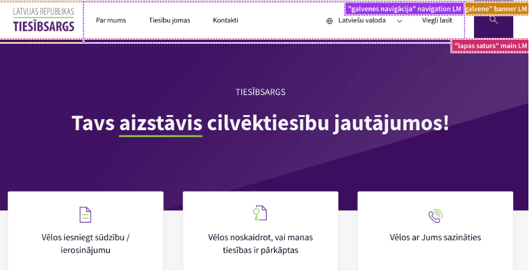
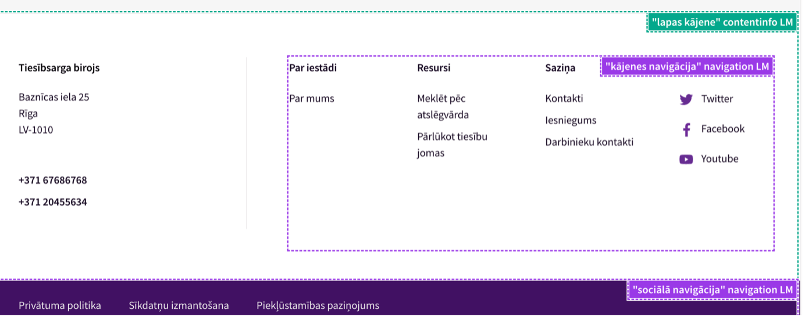
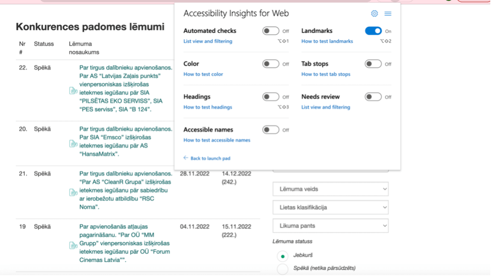

## **2. Pamatstruktūras pārbaude**

Lai visi lietotāji varētu orientēties tīmekļvietnē, pārvietoties pa tās satura blokiem vienlīdz labi, nozīmīga loma ir pārdomātai šīs vietnes pamatstruktūrai. Proti, katram elementam, kas veido tīmekļvietnes pamatstruktūru (_landmarks_), ir jābūt ne vien piekļūstamam, bet arī jāpilda noteikta funkcija.
Tradicionāli tīmekļvietnes pamatstruktūra tiek veidota no trīs satura blokiem: **galvene**, **galvenais saturs** un **kājene**. Taču var tikt izmantoti arī citi satura bloki, piemēram, sānu izvēlnes. Kas ir būtiski – neatkarīgi no tā, cik un kādi satura bloki tiek izmantoti, tiem jābūt redzamiem jeb nodalītiem gan vizuāli, gan funkcionāli. Tas nozīmē, ka šim dalījumam jābūt iestrādātam tīmekļvietnes HTML kodā. Ja tīmekļvietnes satura bloki tiek nodalīti tikai vizuāli, tie nav piekļūstami, jo ir ekrāna lasīšanas ierīcēm neredzami. Viena no biežāk izplatītākajām kļūdām, kas būtiski ierobežo tīmekļvietnes pamatstruktūras lietošanu ar dažādām palīgtehnoloģijām, ir tā, ka atsevišķus tās pamatstruktūras elementus var izmantot tikai ar datorpeli. Piemēram, ja lapas galvenos navigācijas elementus jeb sadaļas parasti var atvērt gan ar datora tastatūru, gan ar datorpeli, to apakšnavigācijas elementus jeb apakšsadaļas var atvērt tikai ar datorpeli, kas tās padara nepiekļūstamas lietotājiem, kuri ierīci ikdienā neizmanto.

### **2.1. Labā prakse**

- Tīmekļvietnē drīkst būt tikai viens galvenais elements jeb satura bloks, kurā tiek ievietots lapas galvenais saturs. Navigācijas bloki var būt vairāki.
- Optimālais pamatstruktūras elementu skaits tīmekļvietnē ir 5 līdz 7. Ja to skaits ir lielāks, tīmekļvietnes navigācija ir apgrūtināta.
- Pamatstruktūras elementi ir jāievieto nevis vienā satura blokā, bet vairākos, sadalot tos pēc "piederības". Piemēram, tīmekļvietnes galvenē tradicionāli tiek iekļauti trīs pamatstruktūras elementi: galvenās navigācijas elementi; elementi, kas ļauj mainīt lapas izskatu – burtu izmēru, valodu u.c.; meklētājs.

> **Labās prakses piemērs.** Lapas pamatstruktūras elementi veidoti strukturēti – “galvenes navigācija”, “galvenais lapas saturs”, “kājenes navigācija” un “sociālā navigācija”.

> **Sliktās prakses piemērs.** Lapā nav atrodami pamatstruktūras elementi un ekrāna lasītājs tos nevar nolasīt.

**Ieteikumi pamatstruktūras veidošanai**:

- Veidojiet visus tīmekļvietnes elementus redzamus, jo slēpti elementi to padara nepiekļūstamu.
- Nodaliet galvenos pamatstruktūras elementus, iekļaujot tos dažādos satura blokos. Turklāt veidojiet šo dalījumu gan vizuālu, gan funkcionālu – iestrādājiet to tīmekļvietnes HTML kodā.
- Kontaktinformācijas sadaļu veidojiet brīvā tekstā, nevis tabulas formātā, jo ekrāna lasīšanas ierīču orientēšanās spējas tabulās ir ļoti ierobežotas. Šīs ierīces nolasa tabulās atspoguļoto informāciju pa šūnām (horizontāli), tāpēc cilvēkiem ar redzes traucējumiem ir ļoti jānopūlas, lai atcerētos kolonnu secību un izskaitļotu, kura šūna un uz kuru kolonnu attiecas. Īpaši sarežģīti viņiem ir uztvert tabulās atspoguļotu saturu, ja tajās ir apvienotas šūnas, jo nav skaidrs, kuras šūnu rindas vai kolonnas attiecas uz šo apvienoto šūnu kopumu. Ļoti bieži apvienoto šūnu princips tiek izmantots, atspoguļojot kontaktinformācijas sadaļā informāciju par darbiniekiem, kuri pārstāv vienu organizācijas struktūrvienību – nodaļu vai departamentu.
- Definējiet visus satura blokus un sekojiet līdzi tam, lai lapas funkcionālie elementi (piemēram, galvenā navigācija un meklētājs) atrodas to satura bloku rāmjos, uz kuriem tie attiecas.
- Iekļaujot tīmekļvietnē vairākus navigācijas blokus, ņemiet vērā, ka katram no tiem ir nepieciešams savs (unikāls) nosaukums.
- Neiekļaujiet tīmekļvietnes pamatstruktūras elementu saturu bloku nosaukumus šo bloku veidu nosaukumos. Piemēram, ja satura bloka veida nosaukums ir "Navigācija", ir pietiekami, ja tajā iekļautā satura bloka nosaukums ir "Galvenā", "Valodu" u.tml. To, ka šajā gadījumā runa ir par "Galveno navigāciju" un "Valodu navigāciju", ekrāna lasīšanas ierīces sapratīs pašas.

### **2.2. Testēšana**

**Accessibility Insights**

1. Atveriet tīmekļvietni, kuru vēlaties pārbaudīt:
1. Aktivizējiet pārbaudes rīku Accessibility Insights (Accessibility Insights → Ad Hoc Tools → Landmarks On). Jūsu datora ekrānā atvērsies logs, kurā būs redzami tīmekļvietnes struktūras elementi. Galvenie tās satura bloki tiks iezīmēti ar raustītu līniju, bet to labajā augšējā stūrī tiks atspoguļots konkrētā bloka nosaukums;
1. Pārliecinieties, ka:

- tīmekļvietnes pamatstruktūru veido vismaz trīs elementi: galvene, galvenā daļa un kājene (šo elementu nosaukumi dažādās tīmekļvietnēs var atšķirties, taču tiem jābūt pietiekami saprotamiem, lai tos varētu atpazīt);
- visa informācija ir saprotama, ja to lasa redzamajā secībā, piemēram, virsraksti atrodas tieši virs informācijas, uz kuru tie attiecas;
- visiem informācijas blokiem ir virsraksti, turklāt tie ir loģiski un viegli saprotami (plašāka informācija par to, kā tiek veidoti piekļūstami virsraksti, pieejama šo vadlīniju 6. nodaļā).

4. Atsevišķi varat pārliecināties, vai:

- tīmekļvietnes pamatstruktūrā ir iekļauts meklētājs;
- kontaktinformācija nav atspoguļota tabulas formātā:
  - Atveriet sadaļu, kurā apkopota kontaktinformācija (ja atsevišķa sadaļa kontaktinformācijai tīmekļvietnē nav paredzēta – šī informācija ir iekļauta, piemēram, kājenē vai lapas sānu izvēlnē, pārbaudi ieteicams veikt tīmekļvietnes galvenajā lapā).
  - Nospiediet jebkurā vietā uz ekrāna ar datorpeles labo taustiņu un izvēlieties izvēlnē opciju Pārbaudīt (Inspect) vai nospiediet taustiņu kombināciju Ctrl + Shift + I (visi taustiņi jāspiež vienlaicīgi). Ekrāna labajā pusē parādīsies konkrētās lapas HTML kods.
  - Rūpīgi apskatiet šo kodu. Ja pie tabulas satura šajā kodā parādās atzīmes `<tbody>` (table body), `<tr>` (table row) vai `<td>` (table data), kontaktinformācija ir atspoguļota tabulas formātā, attiecīgi – tā nav piekļūstama.
