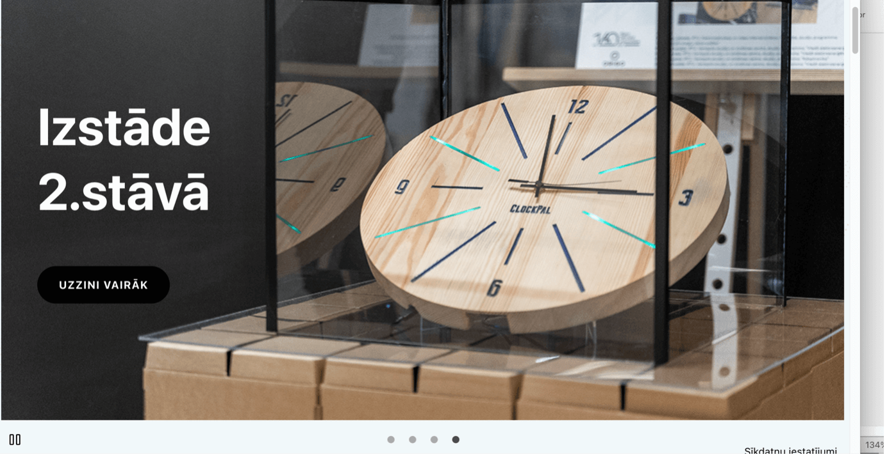
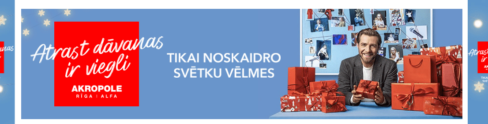

Dažādi kustīgi elementi (attēli un teksti, kas mirgo, zibsnī u.tml.) digitālajā vidē parasti tiek izmantoti, lai pievērstu lietotāju uzmanību un veicinātu viņu mijiedarbību ar digitālo saturu. Salīdzinoši visbiežāk animēti tiek tādi digitālā satura elementi kā:

- Slaideri – attēli, kas secīgi mainās paši vai var tikt mainīti manuāli. Tos bieži izmanto, lai īsi atspoguļotu tīmekļvietnes galvenajā lapā jaunāko, aktuālāko informāciju, piemēram, akcijas piedāvājumus. Tāpat slaideri nereti tiek izmantoti, veidojot foto galerijas.
- Reklāmas banneri un videoklipi.
- Ziņu plūsmas (piemēram, RSS ziņu plūsma) – informācijas monitorēšanas sistēma, kas ļauj veidot tīmekļvietnē jaunāko ziņu apkopojumu par dažādām organizācijai saistošām tēmām. Informācija, kas tiek atspoguļota šajās plūsmās, tiek automātiski "ielasīta" no dažādiem kanāliem (ziņu portāliem, sociālajiem tīkliem u.tml.), izmantojot dažādus atslēgvārdus. Ņemot vērā, ka parasti šajā ziņu plūsmās ir līdz 10 ziņām, tās atkarībā no tēmas aktualitātes var mainīties gan ļoti reti, gan arī nepārtraukti.
- Vērtības, kas atjaunojas automātiski. Uzskatāmākie piemēri ir valūtas kurss, aviobiļešu cenas un aktuālā laika prognoze, ko savās tīmekļvietnēs mēdz publicēt ziņu portāli.

### **10.1. Labā prakse**

- Paredziet iespēju, ka **kustīgos elementus var apturēt vai nopauzēt** – ar tastatūras Escape taustiņu vai uzskatāmu pogu;
- Automātisko animāciju veidojiet tā, lai tā **vienu reizi “nospēlē” un apstājas** (nevis spēlē bez apstājas);
- Pārliecinieties, ka jūsu **attēli mirgo vai zibsnī ne vairāk kā trīs reizes sekundē**. Pirmkārt, saturu, kas kustas ātrāk, ir grūti uztvert. Otrkārt, tas var izraisīt reiboņus, krampjus un citas veselības problēmas.
- Iestatiet kustīgo attēlu animācijas cikla garumu jeb intervālu (laiks no animācijas sākuma līdz brīdim, kad tā beidzas). Optimālais tā laiks ir divas sekundes, maksimālais – piecas;
- Nodrošiniet lietotājiem iespēju noteikt vērtību, kas atjaunojas automātiski, atjaunošanās regularitāti;
- **Izvairieties no GIF attēlu izmantošanas**, jo animācijas ātrumu ietekmēt ir teju neiespējami, tādēļ šis kustīgo attēlu veids tiek uzskatīts par lietotājiem nedraudzīgāko. To ieteicams aizstāt ar HTML5 videoklipiem, kas ir lietotājiem draudzīgāki.

> **Labās prakses piemērs**. Lapā ievietotie slaideri paredz manuālu pāršķiršanu un apstādināšanu.

> **Sliktās prakses piemērs**. Lapā ievietoto reklāmas banneri nav iespējams apstādināt un tas automātiski spēlē bez apstājas.

### **10.2. Testēšana**

1. Atveriet tīmekļvietni vai tās sadaļu, kurā ir publicēts animēts saturs;
2. Pārliecinieties, ka animētā satura elementi ir veidoti, ievērojot 10.1. punktā aprakstītos labās prakses piemērus.
3. Pārbaudiet trīs lietas:
   - vai šis saturs apstājas pats un viena tā cikla garums nepārsniedz piecas sekundes;
   - vai šo saturu var apturēt, ja tas aktivizējas automātiski – atverot konkrēto tīmekļvietnes sadaļu;
   - vai šis saturs nemirgo vai nezibsnī biežāk kā trīs reizes sekundē.
