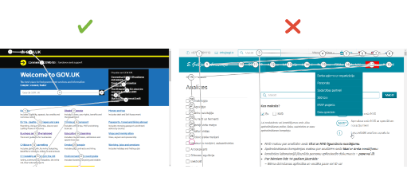

Daudzi datoru lietotāji (piem. ar vāju redzi vai kustību traucējumiem), pārvietojoties tīmekļvietnēs, neizmanto peli, bet citu alternatīvo ierīci. Viens no populārākajiem veidiem ir tastatūra. Lietotāja saskarnēm tīmekļvietnē jābūt veidotām tā, lai tās varētu lietot bez peles. Lai pārvietotos pa tīmekļvietni ar tastatūru, pārsvarā tiek izmantots TAB taustiņš. Ja tīmekļvietne ir piekļūstama, ar TAB taustiņu iespējams piekļūt pilnīgi visiem tās elementiem – gan navigācijas elementiem, gan arī tekstam, attēliem, formām, multimediju vadīklām u.tml. Savukārt, ja tīmekļvietne ir daļēji piekļūstama vai nav piekļūstama, tās satura izmantošana ar tastatūru var būt ļoti apgrūtinoša. Lietotāji mēdz izmantot tastatūru, lai veiktu noteiktus uzdevumus tīmekļvietnē, piemēram, aizpildītu reģistrācijas veidlapu. Piekļūstamu tīmekļvietni veicina arī tas, ja tajā tiek nodrošināts tastatūras vizuālais fokuss jeb aktīvā elementa iezīmēšana (izcelšana). Tas būtiski atvieglo lapas navigāciju, jo skaidri parāda lietotājam, kur tieši tīmekļvietnes lapā viņš atrodas.
Tastatūras lietojamība ir svarīga arī mobilajās ierīcēs. Bieži vien lietotāji ar ierobežojumiem mobilajās ierīcēs izmanto ārējo tastatūru, jo īpaši, ja šiem lietotājiem ir sarežģīti izmantot skārienu žestus.

### **3.1. Labā prakse**

Tīmekļvietnes saturam jābūt piekļūstamam gan ar datorpeli, gan arī ar tastatūru un citām palīgtehnoloģijām. Labā prakse paredz arī to, ka:

- pārvietošanās secība ar TAB taustiņu caur visiem lapas elementiem ir loģiska un dabīga;
- visiem navigācijas elementiem jābūt fokusētiem jeb iezīmētiem – tiem ir jāizceļas, lai lietotājs vienmēr skaidri zina, kur tieši tīmekļvietnē viņš atrodas.

Tomēr, lai lietotāji varētu pilnvērtīgi izmantot tīmekļvietnes saturu ar tastatūru, gan tās piekļuves, gan arī vizuālā fokusa nodrošināšanā ir jāievēro vairāki būtiski nosacījumi.

#### **3.1.1. Tastatūras piekļuves nodrošinājums**

Iespēja pārvietoties pa tīmekļvietni, tās lapām ar TAB taustiņa palīdzību uz priekšu un atpakaļ vēl nenozīmē, ka tastatūras piekļuve ir pilnvērtīga:

- Tabulēšanas secībai jeb secībai, kādā kursors tiek pārvietots pa displeja ekrānu, ir jābilst loģiskai informācijas lasīšanas secībai – no augšas uz leju un no kreisās puses uz labo (uzskatāms piemērs atspoguļots 3. attēlā).
- Tīmekļvietnē nedrīkst būt tā dēvētās "tastatūras lamatas" (salīdzinoši visbiežāk tās ir sastopamas multimediju atskaņotāju vadīklās) – lietotājiem ir jābūt iespējai ar TAB taustiņu ne vien atvērt visus lapas elementus, bet arī aizvērt tos.
- Tīmekļvietnē nedrīkst būt arī tā dēvētās "iznirstošās lamatas", ko var veidot modālie logi, ja tajos nav iespējas nofiksēt kursoru. Šai iespējai nofiksēt kursoru ir ļoti nozīmīga loma, lai lietotājs varētu pabeigt modālajos logos noteiktas darbības. Piemēram, apstiprināt sīkdatnes vai pagarināt, pārtraukt internetbankas sesiju. Proti, iespējai iziet no šiem logiem ir jābūt tikai tad, kad konkrētā darbība ir veikta.
- Ir jāparedz iespēja ar TAB taustiņu ne vien atvērt nolaižamos sarakstus, bet arī brīvi pārvietoties pa to izvēlnēm ar bulttaustiņiem (←↑↓→), turklāt darīt to, neveicot darbības. Viena no biežāk izplatītajām kļūdām šo sarakstu noformēšanā ir tā, ka, līdzko izvēlnē tiek nospiests bulttaustiņš, sarakstā tiek iezīmēts pirmais vienums un atveras jauna lapa, attiecīgi – citus vienumus atzīmēt nav iespējams.
- Ir jāparedz iespēja atvērt visas aktīvās saites, izmantojot taustiņu Enter.

Tāpat ir svarīgi paredzēt tā dēvētās noklusētās navigācijas iespējas jeb īsceļus (_shortcut_):

- ESC – modālo logu (sīkdatņu paziņojumi, reklāmas banneri u.c. logi, kas atveras pa virsu lapas saturam, ienākot tīmekļvietnē) aizvēršana;
- Enter – darbības apstiprinājums (identiska funkcionalitāte kā klikšķim ar datorpeles kreiso taustiņu)
- Ctrl + L – interneta pārlūka adrešu joslā esošās adreses kopēšana;
- Ctrl + Shift + T – pēdējās aizvērtās cilnes atvēršana;
- Ctrl + R vai F5 – konkrētās tīmekļvietnes lapas pārlādēšana jeb atjaunināšana (refresh).

> **Labās un sliktās prakses piemērs.**
> Attēlā pa kreisi TAB taustiņa pārvietošanās "ceļš" pa displeju atbilst loģiskai informācijas lasīšanas secībai (no augšas uz leju, no kreisās puses uz labo). Savukārt attēlā pa labi šis "ceļš" neatbilst piekļūstamības prasībām, jo ir neloģisks (haotisks).

#### **3.1.2. Tastatūras vizuālā fokusa nodrošinājums**

Bieži vien tastatūras vizuālais fokuss estētisku apsvērumu dēļ tiek veidots teju nemanāms. Taču labā prakse paredz, ka aktīvajiem tīmekļvietnes lapas elementiem jābūt labi pamanāmiem jebkurā tīmekļvietnes skatā – arī visos iespējamajos kontrasta režīmos. Tāpēc piemērotākie risinājumi kvalitatīva vizuālā fokusa izveidei ir aktīvo lapas elementu izgaismošana vai ierāmēšana, izmantojot šim nolūkam tādu krāsu, kas kontrastē ar šo elementu pamata krāsu (uzskatāms piemērs atspoguļots 4. attēlā).

4. attēls. Tastatūras vizuālā fokusa labās un sliktās prakses piemērs.
   Augšējā attēlā tastatūra vizuālais fokuss veidots pareizi – ierāmējot lapas aktīvo elementu (teksta logs "E-pasts") ar kontrastējošu zilas krāsas līniju. Savukārt apakšējā attēlā šī fokusa nav vispār.

Īpaši nozīmīga loma labi pamanāmam vizuālajam fokusam ir saišu un formu lapu izcelšanā. Piemēram, gadījumos, kad saite tiek iestrādāta attēlā, bet šis attēls nav iezīmēts pietiekami skaidri, lietotājs var nesaprast, ka zem tā "slēpjas" saite, jo ar TAB taustiņu to aktivizēt nevar. Savukārt, ja formu lapas ir iezīmētas neskaidri vai nav iezīmētas vispār, lietotājs var nepamanīt, ka tās ir jāaizpilda, kas viņam var radīt dažādas neērtības. Piemēram, cilvēkiem ar redzes traucējumiem šādi var tikt liegta iespēja iegādāties to vai citu preci, jo viņiem nav iespējas aizpildīt visu tās pasūtījuma formu.

### **3.2. Testēšana**

Ja plānojiet veikt tastatūras vizuālā fokusa pārbaudi interneta pārlūkā Chrome vai Firefox, ņemiet vērā, ka visi aktīvie lapas elementi, izmantojot tās navigācijai tastatūru, tiks iezīmēti pēc noklusējuma. Savukārt, ja veiksiet tastatūras vizuālā fokusa pārbaudi interneta pārlūkā Safari, jums tastatūras vizuālais fokuss ir jāaktivizē manuāli, jo šajā pārlūkā aktīvie lapas elementi pēc noklusējuma netiek iezīmēti. To var izdarīt pārlūka iestatījumos: Settings → Select System Preferences → Keyboard → All controls.

Ja ikdienā digitālā satura piekļuvei izmantojiet datorpeli, jums tastatūras piekļuves un vizuālā fokusa pārbaudes veikšanai lieti noderēs daži praktiski ieteikumi:

1. Lai sāktu izmantot lapas navigācijai tastatūru, ieklikšķiniet ar datorpeli tās adreses joslā un nolieciet datorpeli malā.
2. Lai pārvietotos pa lapas elementiem secīgi uz priekšu, nospiediet TAB taustiņu. Savukārt, lai pārvietotos pretējā virzienā, piemēram, atgrieztos pie iepriekšējā elementa, izmantojiet taustiņu kombināciju TAB + Shift (spiediet šos taustiņus vienlaicīgi).
3. Lai pārvietotos pa tādiem lapas elementiem kā izvēļņu joslas un nolaižamie saraksti, izmantojiet tastatūrā iestrādātos bulttaustiņus (←↑↓→).
4. Lai atlasītu nolaižamajā sarakstā noteiktu vienumu:
   - pārvietojieties ar TAB taustiņu uz nolaižamā saraksta logu;
   - izmantojiet bulttaustiņus, lai pārvietotu tastatūras vizuālo fokusu uz nepieciešamo vienumu;
   - atlasiet šo vienumu, nospiežot taustiņu Enter vai Space.

#### 3.2.1. Tastatūras piekļuves un vizuālā fokusa pārbaude operētājsistēmā Windows

Ja jūs datorā lietojiet operētājsistēmu Windows, izmantojiet šī piekļūstamības aspekta pārbaudei rīku Accessibility Insights, kas ļauj izvērtēt tastatūras piekļuves un vizuālā fokusa atbilstību piekļūstamības principiem interneta pārlūkos Chrome un Microsoft Edge:

1. Ierakstiet interneta pārlūka teksta laukā tīmekļvietnes, kuru vēlaties novērtēt, adresi.
2. Aktivizējiet tastatūras piekļuves pārbaudes rīku: Accessibility Insights → Ad Hoc Tools → TAB Stops → Show TAB Stops.
3. Nospiediet datora tastatūrā vairākas reizes TAB taustiņu. Jums ekrānā tiks iezīmēts TAB taustiņa pārvietošanās "ceļš" konkrētās tīmekļvietnes lapā.
4. Pārliecinieties, ka:
   - ar TAB taustiņu var piekļūt visam tīmekļvietnes saturam;
   - kustība pa tīmekļvietni ar šo taustiņu ir secīga, proti, konkrētās tīmekļvietnes lapas satura izkārtojums ir loģisks);
   - vizuālais fokuss ir labi redzams;
   - darbojas īsceļi, bet īpaši – ESC, kas ļauj aizvērt modālos logus.

Efektīvs veids, kā salīdzināt labo un slikto praksi tīmekļvietnes pamatstruktūras veidošanā, ir īpaši šim mērķim izstrādāta platforma, ko veidojusi WACG vadlīniju autori:

- <a href="https://www.w3.org/WAI/demos/bad/after/survey" target="_blank">
    Pārvietošanās ar TAB taustiņu pozitīvais piemērs
  </a>
  . Nospiediet TAB taustiņu, lai pārvietotos pa lapas elementiem. Pievērsiet uzmanību,
  ka lielākajai daļai elementu, kad tie ir fokusā, parādās sarkans fons, bet radiopogas
  un ar tām saistītais saturs tiek izcelts ar punktētu rāmi.
- <a href="https://www.w3.org/WAI/demos/bad/before/survey" target="_blank">
    PPārvietošanās ar TAB taustiņu negatīvais piemērs
  </a>
  . Nospiediet TAB taustiņu, lai pārvietotos pa lapas elementiem. Pievērsiet uzmanību,
  ka šajā lapā neviens elements nav fokusēts.

#### **3.2.2. Tastatūras piekļuves un vizuālā fokusa pārbaude operētājsistēmā MacOS**

Šajā gadījumā tastatūras piekļuves un vizuālā fokusa pārbaude ir jāveic interneta pārlūkā Safari, kas ir noklusētais operētājsistēmas MacOS interneta pārlūks:

1. Ierakstiet interneta pārlūka teksta laukā tīmekļvietnes, kuru vēlaties novērtēt, adresi.
2. Aktivizējiet operētājsistēmas iestatījumos pārbaudes veikšanai nepieciešamo rīku: Safari-Preferences → Advanced (logā, kas atvērsies, izvēlieties ikonu, kas atgādina zobratu). Izvēlnes satura blokā Accessibility ieķeksējiet izvēles rūtiņu (check-box), kuras aprakstā ir teksts "Press Tab to highlight each item on a web page".
3. Nospiediet datora tastatūrā vairākas reizes TAB taustiņu. Ekrānā tiks secīgi vizualizēts jeb izcelts katrs tīmekļvietnes navigācijas un satura elements, pa kuru notiks pārvietošanās ar šo taustiņu.
4. Pārliecinieties, ka:
   - ar TAB taustiņu var piekļūt visam tīmekļvietnes saturam;
   - kustība pa tīmekļvietni ar šo taustiņu ir secīga, proti, konkrētās tīmekļvietnes lapas satura izkārtojums ir loģisks);
   - vizuālais fokuss ir labi redzams;
   - darbojas īsceļi, bet īpaši – ESC, kas ļauj aizvērt modālos logus.
