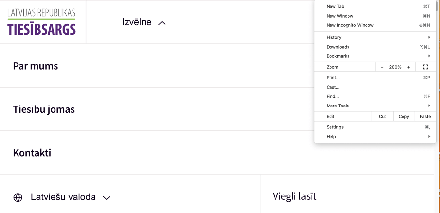
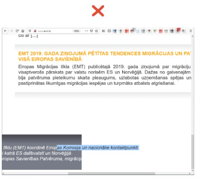

## **8. Teksta izmēra tālummaiņa**

Populārākajos interneta pārlūkos (Chrome, Firefox, Microsoft Edge un Safari) teksta izmēru var mainīt divos veidos:

- Tīmekļvietnes tālummaiņa (page zoom) ļauj pietuvināt vai attālināt ne vien tekstu, bet arī attēlus, ikonas, "pogas" u.tml. To var veikt gan interneta pārlūka, gan arī operētājsistēmas līmenī.
- Teksta izmēra tālummaiņa (text-only zoom) ļauj pietuvināt vai attālināt tikai tekstu. To var veikt interneta pārlūka līmenī. Taču šāda iespēja var būt paredzēta arī tīmekļvietnes līmenī. Šādos gadījumos teksta tālummaiņas ikona, kuras apzīmēšanai parasti izmanto "A" burtu, procentus vai pluss un mīnuss zīmes, tiek iekļauta tīmekļvietnes galvenē līdztekus krāsu kontrastu un citām saskarnes izskatu mainošajām izvēlnēm.

Salīdzinoši visbiežāk lietotāji izmanto minētās iespējas, lai varētu izlasīt tekstu mobilajās ierīcēs. Īpaši aktuāli tas ir cilvēkiem ar redzes traucējumiem un gados vecākiem cilvēkiem. Pieredze liecina, ka seniori digitālā satura palielināšanai datoros un dažkārt arī viedierīcēs nereti izmanto lupu, jo nav informēti par iespējām mainīt teksta izmēru tiešsaistē.

Tomēr teksta izmēra un tīmekļvietnes tālummaiņu mēdz praktizēt arī lietotāji bez jelkādiem redzes traucējumiem. Piemēram, cilvēki, kuri ikdienā daudz strādā ar tekstiem – žurnālisti, korektori, rakstnieki un citi. Un cilvēki, kuri vēlas samazināt slodzi acīm, ko rada ilgstoša koncentrēšanās uz maza izmēra tekstiem.

### **8.1. Labā prakse**

Mainot teksta izmēru tīmekļvietnē, kuras izstrādē un uzturēšanā nav ievēroti piekļūstamības principi, tā var kļūt nelietojama, jo tālummaiņas rezultātā teksts var tikt sakropļots (skatīt zemāk pievienoto attēlu). Bet cilvēkiem ar redzes traucējumiem tā var būt nelietojama uzreiz, jo viņu datoros liels burtu izmērs var būt iestatīts interneta pārlūka vai operētājsistēmas līmenī pēc noklusējuma.

Labā prakse paredz nodrošināt tīmekļvietnē tādu satura noformējumu, ko vienlīdz labi var uztvert gan normālā (100%), gan maksimālā (200%) tālummaiņas režīmā. Tas nozīmē, ka piekļūstams digitālais saturs, pirmkārt un galvenokārt, ir tāds saturs, kas teksta tālummaiņas gadījumā nekādi neietekmē tīmekļvietnes saturu un funkcionalitāti. Otrkārt, tas ir tāds saturs, kura uztveršanai teksta tālummaiņas gadījumā nav jāizmanto palīgtehnoloģijas. Piemēram, operētājsistēmas līmenī iebūvētais ekrāna palielinātājs (screen magnifier), kas ļauj pietuvināt atsevišķus lapas fragmentus (piemērs, kas atspoguļo izmaiņas, kas var vai nevar notikt tīmekļvietnes skatā pēc tālummaiņas, atspoguļots 10. un 11. attēlā).

Šādu satura noformējumu iespējams panākt, veidojot tīmekļvietnes pēc principa "mobile first". Tas nozīmē, ka teksta tālummaiņas gadījumā tīmekļvietnes saskarne tiek atspoguļota mobilajā izklājumā. Ja vien šajā izklājumā neiztrūkst atsevišķi elementi (piemēram, iepirkumu grozs vai lietotāju autentifikācijas logs), kas var būt neapdomīgi likvidēti, jo tā šķiet praktiskāk, estētiskāk u.tml., tīmekļvietne arī maksimālā teksta izmēra palielinājuma režīmā turpina funkcionēt pilnvērtīgi:

- lielāki kļūst tikai teksti, nevis attēli un citi vizuālie elementi;
- lielāki kļūst visi tīmekļvietnē publicētie teksti (ja teksts ir publicēts attēla formātā, tas nemainīsies, attiecīgi – maksimālās tālummaiņas režīmā nebūs salasāms);
- visi teksti joprojām ir pieejami pilnā apjomā – teikumi nav aprauti, nav pazuduši atsevišķi teksta fragmenti;
- teksta slejas un sekcijas, kā arī attēli un citi satura elementi nepārklājas;
- visas atstarpes starp teksta rindām joprojām ir savās vietās;
- visi teksta bloki ir redzami un brīvi izlasāmi – to lasīšanai nav jāizmanto tā dēvētā horizontālā "ritināšana" (tā ir pieļaujama tikai, lai pārietu uz citu tīmekļvietnes sadaļu);
- visi tīmekļvietnes aktīvie elementi ir izmantojami ne vien ar datorpeli, bet arī ar TAB taustiņu;
- visi tīmekļvietnes aktīvie elementi ir fokusēti;
- tīmekļvietnē joprojām ir iespēja izmantot visas izvēlnes (piemēram, mainīt valodas un krāsu kontrastus), vadīklas (piemēram, tīmekļvietnes aizvēršanas poga), kā arī formu laukus (piemēram, meklēšanas logs).

> **Labās prakses piemērs**.

    Tīmekļvietne pēc tālummaiņas ir ieguvusi saglabājusi pilnu funkcionalitāti. Nav mainījies arī tās teksta elementu noformējums – tie nepārklājas un joprojām ir viegli salasāmi.

> **Sliktās prakses piemērs**.Pēc tālummaiņas lapai apakšpusē ir parādījusies horizontālās ritināšanas rīkjosla (scroll-bar). Tā ir viena no pirmajām pazīmēm, kas norāda uz to, ka lapas saturs ekrānā netiek atspoguļots pilnā apmērā. Tāpat daļa no lapas satura ir kļuvusi neredzama (kājenē ietvertais teksts nav salasāms) un nepieejama (piemēram, lapas augšpusē ir pazudis valodu pārslēgs).

### **8.2. Testēšana**

Par to, ka teksta un lapas tālummaiņas gadījumā tīmekļvietnes saturs joprojām ir piekļūstams teju ikvienam lietotājam, var pārliecināties vairākos veidos.

#### **8.2.1. Teksta tālummaiņas pārbaude interneta pārlūkos Chrome un Firefox**

Lai veiktu tālummaiņas pārbaudi interneta pārlūkos Chrome un Firefox:

1. Ierakstiet interneta pārlūka teksta laukā tīmekļvietnes, kuru vēlaties novērtēt, adresi.
2. Iestatiet izvēlētā interneta pārlūka rīkjoslā teksta tālummaiņas režīmu: Skats (View) → Tālummaiņa (Zoom) → Tikai teksta tālummaiņa (Zoom Text Only). Šo režīmu var iestatīt arī ar datora tastatūras taustiņu kombināciju Alt + V, Z, T.
3. Palieliniet tekstu līdz 200%:
   - Ja izmantojat operētājsistēmu Windows vai Linux, nospiediet datora tastatūrā taustiņu kombināciju Ctrl + [+] (turiet nospiestu kontroles taustiņu un nospiediet četras līdz sešas reizes taustiņu [+]). Līdzīgu rezultātu var panākt, nospiežot taustiņu Ctrl un rullējot datorpeles rullīti uz augšu jeb prom no sevis (rullējot rullīti uz leju jeb uz sevi, teksta izmērs samazinās).
   - Ja izmantojat operētājsistēmu MacOS, nospiediet datora tastatūrā taustiņu kombināciju Cmd + [+] (turiet nospiestu komandtaustiņu un vienlaikus četras līdz sešas reizes nospiediet taustiņu +). Līdzīgu rezultātu var panākt, nospiežot taustiņu Cmd un rullējot datorpeles rullīti uz augšu jeb prom no sevis (rullējot rullīti uz leju jeb uz sevi, teksta izmērs samazinās).
   - Neatkarīgi no tā, kādu operētājsistēmu izmantojiet, teksta tālummaiņu var veikt arī interneta pārlūka rīkjoslā. Atveriet tās izvēlni un sadaļā Tālummaiņa (Zoom) uzklikšķiniet uz pogas "+", lai palielinātu tekstu, bet uz pogas "-", lai samazinātu. Skaitlis, kas redzams starp šīm pogām, ir pašreizējās tālummaiņas procentuālā vērtība.
4. Pārliecinieties, ka teksta tālummaiņa nav ietekmējusi tīmekļvietnes saturu un funkcionalitāti atbilstoši 8.1. punktā aprakstītajiem labās prakses piemēriem.

#### 8.2.2. Teksta tālummaiņas pārbaude interneta pārlūkā Safari

Pārbaude iespējama operētājsistēmā MacOS. Lai veiktu pārbaudi:

1. Ierakstiet interneta pārlūka teksta laukā tīmekļvietnes, kuru vēlaties novērtēt, adresi.
2. Palieliniet tekstu līdz 200%. To var izdarīt divējādi:
   - Atveriet interneta pārlūka rīkjoslas izvēlni un palieliniet tekstu: Skatīt izvēlni (View Menu) → Palielināt tekstu (Make Text Bigger).
   - Nospiediet datora tastatūrā taustiņu kombināciju Alt + Cmd + [+] (turiet nospiestu Alt un komandtaustiņu un vienlaikus četras līdz sešas reizes nospiediet taustiņu [+]).
3. Pārliecinieties, ka teksta tālummaiņa nav ietekmējusi tīmekļvietnes saturu un funkcionalitāti atbilstoši 8.1. punktā aprakstītajiem labās prakses piemēriem.
