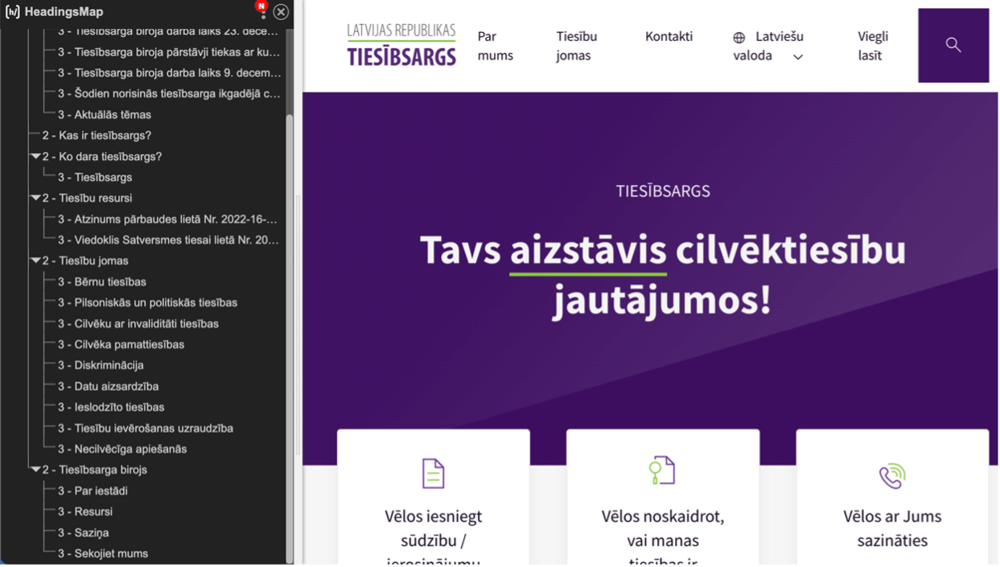
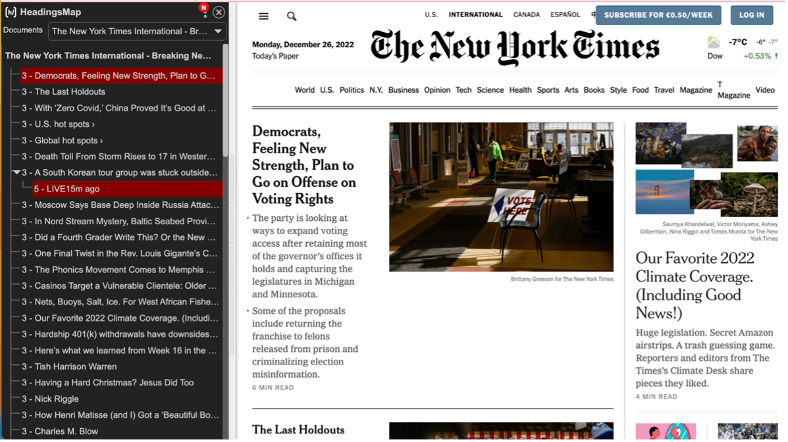
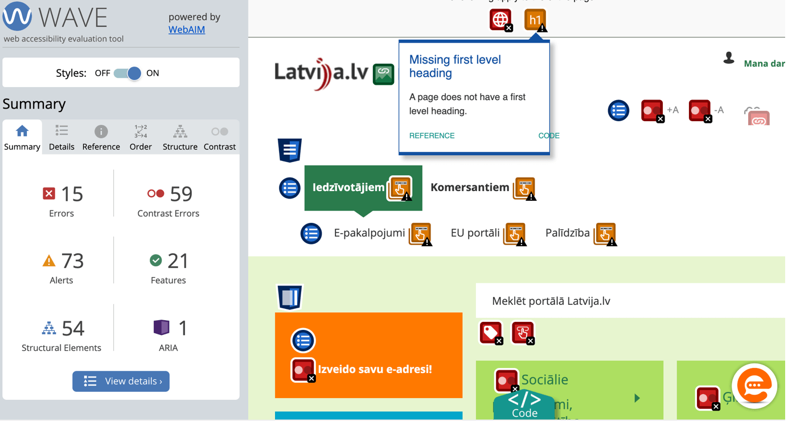

## **6. Virsraksti**

Virsraksti ir lapas satura “mugurkauls”. Cilvēkam ir grūti uztvert lielu informācijas apjomu, kas izkārtots vienlaidus. Virsraksti tiek izmantoti, lai izveidotu loģisku satura struktūru, kā arī sadalītu to tematiskajos blokos, tā uzskatāmi norādot, kāda informācija tekstā ir primārā (galvenā) un kāda tai ir pakārtota. veidots tīmekļvietnes satura vadības sistēmā, attiecīgi – tas ir iezīmēts tīmekļvietnes kodā.
Virsrakstu strukturēšana palīdz orientēties tīmekļvietnē lietotājiem, kuri:

- izmanto ekrāna lasīšanas ierīces (tām ir atsevišķa funkcija, kas nodrošina tikai virsrakstu lasīšanu);
- izmanto navigācijai tikai tastatūru, jo kāda iemesla dēļ nevar izmantot datorpeli (piemēram, viņiem ir kustību traucējumi rokās).

### **6.1. Labā prakse**

Piekļūstami virsraksti ir ne vien viegli uztverami satura un noformējuma ziņā, bet arī nodala dažādus satura elementus un ir izkārtoti loģiskā, jēgpilnā secībā jeb hierarhijā. Pretējā gadījumā tīmekļvietnes struktūras kods būs nepareizs un tās mijiedarbība ar lietotājiem būs apgrūtināta vai neiespējama.

- Katrā lapā izmantojiet **vienu unikālu virsrakstu “h1”**, kas apraksta, par ko ir šī lapa. Vairāku “h1” virsrakstu izmantošana ir slikta prakse gan piekļūstamības, gan SEO aspektā;
- Izmantojiet virsrakstus, lai **aprakstītu lapas saturu**, nevis tāpēc, lai teksts izskatītos lielāks un izceltos;
- Izmantojiet virsrakstu līmeņus tāpat kā grāmatu satura rādītājus – **hierarhijā**;
- Izvēlieties virsrakstu nevis pēc tā lieluma, bet gan pēc tā līmeņa satura kontekstā;
- **Neizlaidiet kādu no virsraksta līmeņiem**. Piemēram, virsraksts “h2” tiek pievienots aiz virsraksta“h1”.

Hierarhija nozīmē, ka virsraksti sakārtoti secībā no vissvarīgākā līdz vismazāk svarīgajam. “H1” ir vissvarīgākais virsrakstu līmenis, “h6” - vismazāk svarīgais.

> **Virsrakstu hierarhijas piemērs**.

- h1 = Lapas virsraksts - 
    h2
   = apakšvirsraksts lapas saturā - h3 =
  h2 apakšvirsraksts - h4 = h3 apakšvirsraksts - 
    h2
   = apakšvirsraksts lapas saturā - h2 =
  Saistītās ziņas (blakus sadaļa) - h2=
  Sazinieties ar mums (kājenes sadaļā) - h3= adrese
  (adreses informācija) - h3= Sekojiet mums (saites
  uz sociālajiem medijiem)

> **Labās prakses piemērs**. Virsrakstu struktūra lapā veidota loģiskā secībā – hierarhijā.

> **Sliktās prakses piemērs**. Virsrakstu struktūras līmeņos nav ievērota hierarhija. Piemēram, lapā nav galvenā virsraksta “h1”, pēc virsraksta “h3” seko “h5”.

### **6.2. Testēšana**

Virsrakstu piekļūstamību var pārbaudīt pēc **virsrakstu iezīmēm** un to **struktūras**.

#### **6.2.1. Virsrakstu iezīmju pārbaude**

Virsrakstu iezīmes jeb to, vai teksts, kas vizuāli izskatās pēc virsraksta, patiešām tāds arī ir, var noteikt ar tādiem rīkiem, kā piem., **Wave** un **Accessibility Insights**. Par virsrakstu iezīmēm uzskatāmi to līmeņu apzīmējumi – "h1", "h2", "h3" u.c.

Lai pārbaudītu virsrakstu iezīmes ar **Wave** rīku:

1. Ierakstiet interneta pārlūka teksta laukā tīmekļvietnes adresi, kuru vēlaties novērtēt;
2. Uzklikšķiniet Wave rīka izvēlnē uz pogas Wave This Page. Pie visiem virsrakstiem, kas ir iezīmēti tīmekļvietnes kodā, parādīsies mazas ikonas. Savukārt pie virsrakstiem, kas nav funkcionāli, šādas ikonas nebūs;
3. Pārbaudiet trīs lietas:
   - vai tīmekļvietnes strukturējumā ir uzskaitīti visi virsraksti;
   - vai visi teksti, kas vizuāli atgādina virsrakstus, tādi arī ir -vai tie ir iekļauti tīmekļvietnes strukturējumā;
   - vai tīmekļvietnes strukturējumā nav iekļauts kāds elements, kas nav virsraksts.

> **Piemērs**. Virsrakstu pārbaude ar Wave rīku.

Līdzīgi kā tastatūras piekļuves un vizuālā fokusa pārbaudes gadījumā, arī virsrakstu iezīmju veidošanas labo un slikto praksi var salīdzināt īpaši šim mērķim izstrādātajā platformā, ko veidojusi WACG vadlīniju autori:

- <a href="https://www.w3.org/WAI/demos/bad/after/home" target="_blank">
    Virsrakstu iezīmju veidošanas pozitīvais piemērs
  </a>
  . Aktivizējiet šajā tīmekļvietnē rīku Wave vai Accessibility Insights. Pievērsiet
  uzmanību ikonām, kas atrodas pie virsrakstiem. Tās apliecina, ka virsraksti ir
  funkcionāli.
- <a href="https://www.w3.org/WAI/demos/bad/before/home" target="_blank">
    Virsrakstu iezīmju veidošanas negatīvais piemērs
  </a>
  . Aktivizējiet šajā tīmekļvietnē rīku Wave vai Accessibility Insights (Accessibility
  Insights → Ad Hoc Tools → Headings). Pievērsiet uzmanību, ka pie teksta, kas vizuāli
  atgādina virsrakstu, nav ikonas. Tas nozīmē, ka šis virsraksts nav funkcionāls.

#### **6.2.2. Virsrakstu strukturējuma pārbaude**

Virsrakstu struktūru var pārbaudīt ar rīku **HeadingsMap**. Par virsrakstu iezīmju strukturējumu uzskatāma to hierarhija jeb tīmekļvietnes kodā iezīmētā virsrakstu struktūra.  
**HeadingsMap**

1. Pievienojiet <a href="https://chrome.google.com/webstore/detail/headingsmap/flbjommegcjonpdmenkdiocclhjacmbi" target="_blank">HeadingsMap</a> kā Chrome <a href="https://addons.mozilla.org/en-US/firefox/addon/headingsmap/" target="_blank">(vai Firefox)</a> paplašinājumu;
2. Ierakstiet interneta pārlūka teksta laukā tīmekļvietnes adresi, kuru vēlaties pārbaudīt;
3. Uzklikšķiniet uz HeadingsMap ikonas. Ekrānā tiks atvērts tīmekļvietnes satura koks;
4. Pārbaudiet divas lietas:

-     vai šo virsrakstu struktūra ir loģiska (piemēram, vai zem kāda virsraksta kā apakšvirsraksti neparādās virsraksti, kas uz konkrēto tēmu neattiecas);
- vai tīmekļvietnes strukturējumā ir uzskaitīti visi virsraksti.

Arī šajā gadījumā labo un slikto praksi var salīdzināt WACG vadlīniju autoru izveidotajā platformā:

- <a href="https://www.w3.org/WAI/demos/bad/after/news" target="_blank">
    Virsrakstu struktūras pozitīvais piemērs
  </a>
  . Aktivizējiet šajā tīmekļvietnē rīku Headings Map (Chrome) Pievērsiet uzmanību,
  ka šajā gadījumā tīmekļvietnes virsrakstu strukturējums ir ļoti precīzs.
- <a href="https://www.w3.org/WAI/demos/bad/before/news" target="_blank">
    Virsrakstu struktūras negatīvais piemērs
  </a>
  . Aktivizējiet šajā tīmekļvietnē rīkus Headings Map vai A11y-Outliner. Pievērsiet
  uzmanību, ka šeit ir tikai viens virsraksts.
